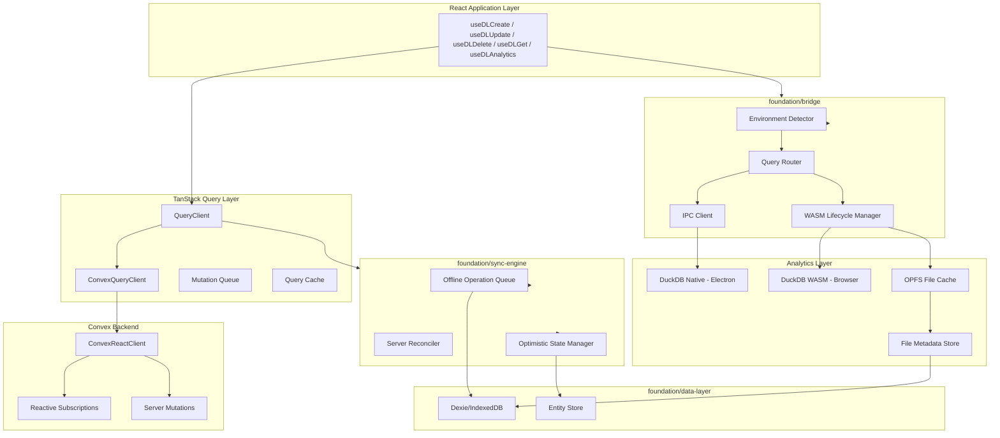
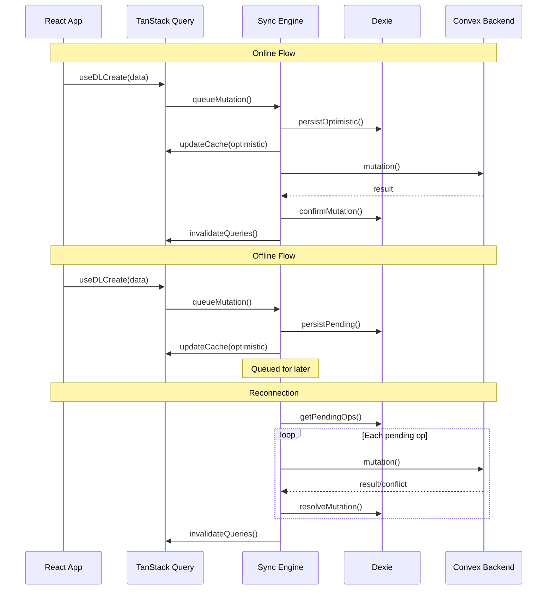
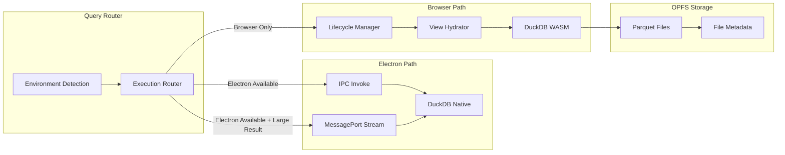
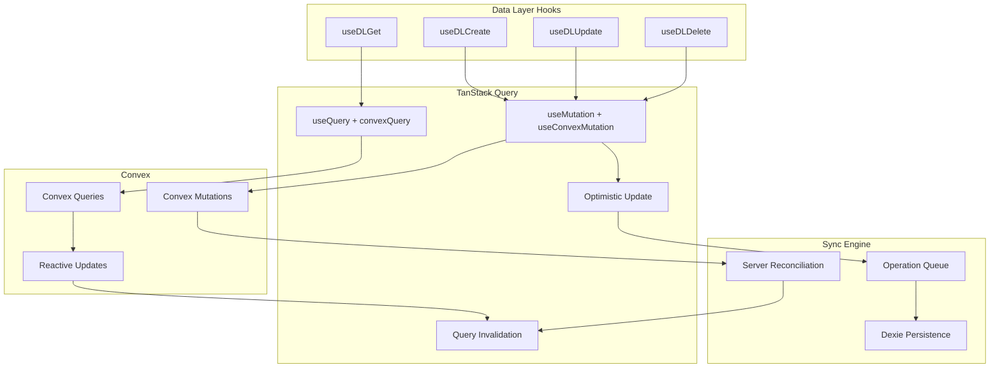
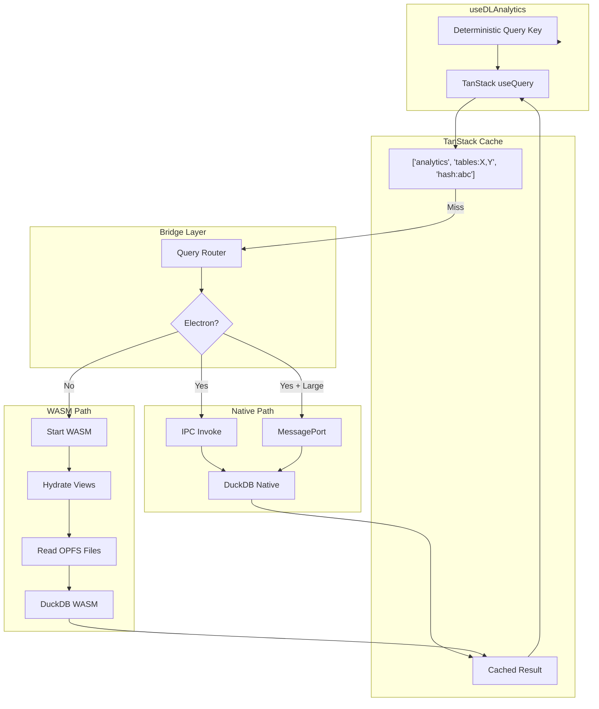

# Offline-First Sync Engine Architecture

## Executive Summary

This architecture delivers a **Linear-style offline-first sync engine** that:

- Works **fully offline** with deterministic local state
- Uses **Convex as the authoritative backend** with TanStack Query orchestration
- Provides **dual DuckDB execution** (Native via Electron IPC, WASM fallback)
- Caches **Parquet files in OPFS** for offline analytics
- Exposes clean hooks: `useDLCreate`, `useDLUpdate`, `useDLDelete`, `useDLGet`, `useDLAnalytics`

---

## High-Level Architecture



---

## Foundation Layer Architecture

### 1. `foundation/data-model` (Existing - Extend)

Canonical type definitions shared across all layers:

```typescript
// Entity base types
interface BaseEntity {
  id: string;
  _creationTime: number;
  _updatedTime: number;
}

// Analytics query types
interface AnalyticsQuery {
  tables: string[];
  sql: string;
  params?: Record<string, unknown>;
}
interface AnalyticsQueryKey {
  type: 'analytics';
  tables: string[];
  queryHash: string;
}

// Sync metadata types
interface SyncMetadata {
  localVersion: number;
  serverVersion: number;
  pendingOps: number;
}
```

### 2. `foundation/database` (Rewrite)

Dexie-based persistence for:

- **Entity storage** (offline cache of Convex data)
- **Pending operations queue** (offline mutations)
- **File metadata** (Parquet file registry for DuckDB)
- **Sync cursors** (last sync timestamps per entity type)

Key stores:

```
_entities: id, type, data, localVersion, serverVersion, syncStatus
_pendingOps: ++localId, entityType, entityId, mutation, args, createdAt, retries
_fileMetadata: fileId, logicalTable, schema, partitionKey, fileSize, lastModified
_syncCursors: entityType, cursor, lastSyncAt
```

### 3. `foundation/sync-engine` (New - Core Implementation)

The heart of offline-first sync:



**Key Responsibilities:**

- Offline operation queue management
- Optimistic update application
- Server reconciliation (server-authoritative)
- Conflict detection and resolution
- TanStack Query cache coordination

### 4. `foundation/bridge` (New - DuckDB Abstraction)

Environment-agnostic analytics execution:



**Key Features:**

- **Environment detection**: Check for Electron IPC availability
- **Query routing**: Native DuckDB preferred, WASM fallback
- **IPC modes**: `invoke` for simple queries, `MessagePort` for streaming
- **WASM lifecycle**: 30s idle shutdown, deterministic rehydration
- **OPFS management**: File caching, metadata persistence

---

## Data Flow Architecture

### CRUD Operations (Convex-backed)



### Analytics Queries (DuckDB-backed)



---

## Hook API Design

### Core CRUD Hooks

```typescript
// useDLGet - Read single entity or list
const { data, isLoading, error } = useDLGet<User>('users', userId);
const { data: users } = useDLGet<User[]>('users', {
  filter: { role: 'admin' },
});

// useDLCreate - Create with optimistic update
const { mutate: create, isPending } = useDLCreate<User>('users');
create({ name: 'John', email: 'john@example.com' });

// useDLUpdate - Update with optimistic update
const { mutate: update, isPending } = useDLUpdate<User>('users');
update({ id: userId, name: 'Jane' });

// useDLDelete - Delete with optimistic update
const { mutate: remove, isPending } = useDLDelete('users');
remove(userId);
```

### Analytics Hook

```typescript
// useDLAnalytics - Query DuckDB with TanStack Query caching
const { data, isLoading, error } = useDLAnalytics({
  tables: ['events', 'users'],
  sql: 'SELECT COUNT(*) FROM events e JOIN users u ON e.user_id = u.id WHERE u.role = ?',
  params: { role: 'admin' },
  // Invalidation happens via table names
});

// useDLAnalyticsMutation - For analytical writes (rare)
const { mutate } = useDLAnalyticsMutation();
mutate({
  sql: 'INSERT INTO analytics_cache ...',
  invalidateTables: ['analytics_cache'],
});
```

---

## Query Key Strategy (Critical)

All analytics queries MUST have deterministic query keys:

```typescript
// Query key structure
type AnalyticsQueryKey = [
  'analytics', // Namespace
  `tables:${string}`, // Logical table dependencies (sorted)
  `query:${string}`, // Query identity hash
];

// Example
['analytics', 'tables:events,users', 'query:session_duration_v3'];

// Invalidation by table
queryClient.invalidateQueries({ queryKey: ['analytics', 'tables:events'] });

// Invalidation by exact query
queryClient.invalidateQueries({
  queryKey: ['analytics', 'tables:events,users', 'query:session_duration_v3'],
});
```

---

## Libraries to Generate

Using `npx nx generate @nx/react:library`:

| Library | Directory | Tags | Purpose |

|---------|-----------|------|---------|

| `foundation-sync-engine` | `libs/foundation/sync-engine` | `foundation:sync-engine` | Offline-first sync orchestration |

| `foundation-bridge` | `libs/foundation/bridge` | `foundation:bridge` | DuckDB execution abstraction |

**Note:** `foundation/data-layer` and `foundation/database` will be **rewritten** to integrate with the new architecture.

---

## ESLint Module Boundary Updates

Add to [`eslint.config.mjs`](eslint.config.mjs):

```javascript

// foundation:sync-engine -> Can import data-layer, database, utils, data-model, trackers

{

sourceTag: 'foundation:sync-engine',

onlyDependOnLibsWithTags: [

'foundation:sync-engine',

'foundation:data-layer',

'foundation:database',

'foundation:utils',

'foundation:data-model',

'foundation:trackers',

],

},

// foundation:bridge -> Can import database, utils, data-model, trackers

{

sourceTag: 'foundation:bridge',

onlyDependOnLibsWithTags: [

'foundation:bridge',

'foundation:database',

'foundation:utils
```
