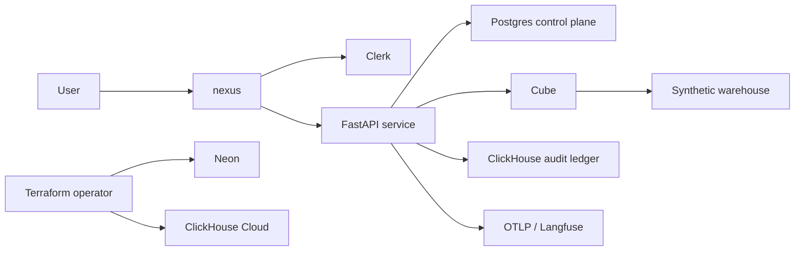

# System Context

The User interacts with the Forensic Observatory. Clerk supplies identity, but
provider identifiers are resolved to internal UUIDs before product behavior.
The FastAPI service composes the application core and adapters.

Postgres owns transactional state and tenant authorization. Cube owns governed
analytical definitions over the warehouse. ClickHouse owns immutable audit
replay. Telemetry may export traces to a configured OTLP endpoint.

Local Docker services reproduce the database/semantic dependencies. Terraform
defines managed Neon and ClickHouse Cloud resources, but no application
deployment pipeline is present.

See [[Hexagonal Modular Monolith]], [[Tenancy Security]], and
[[Audit and Observability Architecture]].

Parent: [[Architecture MOC]]
