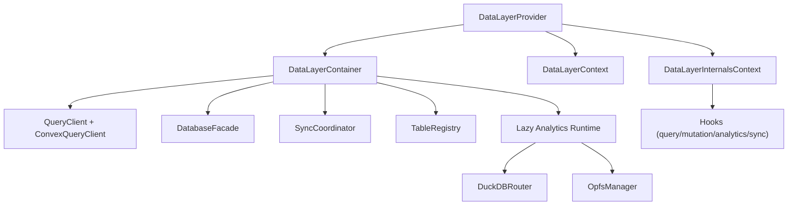

# Foundation Data Layer

`@open-insights-web/foundation-data-layer` is the enterprise React data runtime for Open Insights.
It unifies Convex reads/writes, offline-first persistence, optimistic mutation orchestration, analytics SQL execution, and background parquet synchronization.

## Table Of Contents

- [What This Library Owns](#what-this-library-owns)
- [Installation And Setup](#installation-and-setup)
- [Configuration Reference](#configuration-reference)
- [Public API Reference](#public-api-reference)
- [Architecture](#architecture)
- [Advanced Usage](#advanced-usage)
- [Performance And Caching Guidance](#performance-and-caching-guidance)
- [Failure Modes And Recovery](#failure-modes-and-recovery)
- [Migration Guide (Breaking Release)](#migration-guide-breaking-release)
- [Contributing And Extending](#contributing-and-extending)
- [Validation Commands](#validation-commands)

## What This Library Owns

This library is the composition layer on top of foundation core packages:

- `@open-insights-web/foundation-data-model`: shared contracts, constants, branded primitives, query-key hashing
- `@open-insights-web/foundation-database`: IndexedDB/OPFS persistence facade
- `@open-insights-web/foundation-sync-engine`: offline queue, sync orchestration, conflict handling
- `@open-insights-web/foundation-bridge`: DuckDB router and SQL helpers
- `@open-insights-web/foundation-utils`: logging, synchronization primitives, platform utilities

Primary responsibilities:

- Online Convex query/mutation execution
- Offline query fallback from IndexedDB cache
- Optimistic create/update/delete with rollback and queueing
- Analytics SQL query/mutation execution through DuckDB
- Background parquet download + persistence + sync status
- Conflict surface and resolution hooks

## Installation And Setup

```bash
npm install @open-insights-web/foundation-data-layer @tanstack/react-query convex
```

Required runtime assumptions:

- React 18+
- Browser runtime with IndexedDB support
- For analytics features: WASM support, workers, and OPFS availability in target environment

Typical environment variables:

- `VITE_CONVEX_URL`: Convex deployment URL

Minimal provider setup:

```tsx
import { DataLayerProvider } from '@open-insights-web/foundation-data-layer';
import { CONFLICT_STRATEGY } from '@open-insights-web/foundation-data-model';

import { api } from '../convex/_generated/api';

export const AppProviders = ({ children }: { children: React.ReactNode }) => (
  <DataLayerProvider
    config={{
      convexUrl: import.meta.env.VITE_CONVEX_URL,
      conflictStrategy: CONFLICT_STRATEGY.LAST_WRITE_WINS,
      enableCrossTab: true,
      enableAnalytics: true,
      datasourceApi: api.datasource.list,
      tables: [
        {
          name: 'events',
          convex: {
            list: api.events.list,
            get: api.events.get,
            create: api.events.create,
            update: api.events.update,
            delete: api.events.remove,
          },
          analytics: { enabled: true },
        },
      ],
    }}
  >
    {children}
  </DataLayerProvider>
);
```

## Configuration Reference

`DataLayerConfig`:

- `convexUrl` (`string`, required): Convex deployment URL
- `tables` (`ReadonlyArray<UnifiedTableConfig>`, optional): unified table registry configuration
- `datasourceApi` (`ConvexQueryReference`, optional): datasource metadata query for background parquet sync
- `conflictStrategy` (`ConflictStrategy`, optional): default global strategy value from `CONFLICT_STRATEGY`
- `enableCrossTab` (`boolean`, optional, default `true`)
- `enableAnalytics` (`boolean`, optional, default `true`)
- `defaultStaleTime` (`number`, optional)
- `defaultGcTime` (`number`, optional)
- `cache` (`CacheConfig`, optional)
- `debug` (`boolean`, optional)
- `onSyncError` (`(error, context?) => void`, optional)

`UnifiedTableConfig`:

- `name`
- `convex` (`list` / `get` / `create` / `update` / `delete`)
- `staleTime`
- `gcTime`
- `conflictStrategy`
- `mergeConfig`
- `analytics` (`enabled`, `freshness`, `staleTime`)

Data-layer constants for operations/freshness:

- `TABLE_OPERATION`
- `DATA_FRESHNESS`
- `CONFLICT_RESOLUTION_TYPE`

## Public API Reference

Provider and context:

- `DataLayerProvider`
- `useDataLayer`

Core query hooks:

- `useDLGet`
- `useDLGetList`
- `useDLGetOne`

Core mutation hooks:

- `useDLCreate`
- `useDLUpdate`
- `useDLDelete`

Analytics hooks:

- `useDLAnalytics`
- `useDLAnalyticsMutation`
- `useCreateAnalyticsView`
- `useDropAnalyticsView`
- `useExecuteAnalyticsSql`
- `useLoadParquetFile`
- `useCopyToParquet`

Sync/conflict hooks:

- `useSyncStatus`
- `useSyncTrigger`
- `useSyncEventListener`
- `useConflictResolution`
- `useEntityConflict`
- `useConflicts`
- `useBackgroundFileSync`

Advanced composition:

- `DataLayerContainer`
- `createDataLayerContainer`
- `TableRegistry`
- `createTableRegistry`

## Architecture

High-level composition:



Module map:

- `src/core`: container, registry, constants, shared types
- `src/provider`: provider and internal/public contexts
- `src/hooks`: public hook surface
- `src/analytics-sync`: table sync + file download services and background sync hook
- `src/utils`: shared mutation/query/analytics helpers and error handling

Architectural constraints in this release:

- Internal implementation imports concrete modules directly (no internal barrel-import fan-out)
- Shared datasource contracts live in `foundation-data-model`
- Table sync and file download services are container-scoped lazy singletons
- No `fetch` usage in data-layer runtime; Axios-based download path is used

## Advanced Usage

Offline-first create/update/delete:

```tsx
const createEvent = useDLCreate({
  mutation: api.events.create,
  table: 'events',
  listQueryKey: ['events'],
  onOptimistic: (vars) => ({
    ...vars,
    createdAt: new Date().toISOString(),
  }),
});

await createEvent.mutateAsync({ name: 'offline-safe' });
if (createEvent.isQueued) {
  // queued locally; sync-engine will flush on reconnect
}
```

Analytics sync with progress:

```tsx
const sync = useBackgroundFileSync({
  tables: ['events', 'sessions'],
  enabled: true,
  onProgress: (state) => {
    console.log(state.progress, state.filesCompleted, state.filesTotal);
  },
});
```

Conflict resolution:

```tsx
const { conflicts, resolveConflict } = useConflictResolution();

for (const conflict of conflicts) {
  await resolveConflict(conflict.id, {
    type: CONFLICT_RESOLUTION_TYPE.ACCEPT_REMOTE,
  });
}
```

## Performance And Caching Guidance

- Analytics runtime is lazy-initialized; no DuckDB startup cost until analytics hooks run.
- Use table-level `staleTime` and `gcTime` overrides for high-volume tables.
- Background sync downloads files concurrently, but file writes are serialized to avoid OPFS handle contention.
- Mutation hooks centralize local-first execution and query invalidation logic through shared helpers.
- Keep `enableAnalytics` false in deployments that do not require SQL analytics.

## Failure Modes And Recovery

- `No datasource API configured`: configure `datasourceApi` for background file sync.
- `DuckDB is not available`: verify browser/runtime support and analytics runtime initialization.
- Offline query misses cache: `useDLGet` throws when neither network nor cache can satisfy a request.
- Sync pipeline errors: subscribe via `useSyncStatus` and handle `onSyncError` in provider config.
- Conflict accumulation: resolve through `useConflictResolution` or apply a bulk strategy (`resolveAll`).

## Migration Guide (Breaking Release)

This release includes intentional breaking changes for strict typing and naming consistency.

### Constant renames

- `ErrorSeverity` -> `ERROR_SEVERITY`
- `HookContext` -> `HOOK_CONTEXT`

No legacy aliases are retained.

### Mutation return typing

- `DLMutationResult.mutateAsync` now returns `Promise<TData | undefined>`.
- `useDLDelete` offline path returns `undefined` as a typed result.

### Data source type consolidation

Datasource contracts are centralized in `foundation-data-model` and consumed by data-layer/query-engine:

- `DataSourceFileInfo`
- `DataSourceTableInfo`
- `DataSourceMetadata`
- `DataSourceResponse`
- `DataSourceRequest`

### Const-backed option types

String-literal options were replaced or normalized to const-backed values where applicable.
Use exported constants instead of handwritten string unions.

### Internal import policy

Implementation code should import concrete modules directly.
Only package-root API exports should be consumed by downstream libraries/apps.

## Contributing And Extending

Engineering rules for this library:

- Keep strict TypeScript compatibility (`noUncheckedIndexedAccess`, `exactOptionalPropertyTypes`).
- Avoid explicit `undefined` assignment to optional props unless the type allows it.
- Use `UPPER_SNAKE_CASE` for constants and `PascalCase` for types/interfaces/enums.
- Prefer shared utilities over duplicated hook logic.
- Keep public hook behavior documented with concise JSDoc.
- Use Axios (or configured Axios instances) for HTTP operations.

When adding new hook features:

1. Add or reuse utility logic in `src/utils` first.
2. Keep hook files thin and strategy-driven.
3. Add tests in `src/hooks/*.spec.tsx` for online/offline and error behavior.
4. Update root exports in `src/index.ts` only for intended public surface.

## Validation Commands

```bash
npx eslint libs/foundation/data-layer/src --ext .ts,.tsx --max-warnings=0
npx vitest run libs/foundation/data-layer/src
npx tsc -b libs/foundation/bridge/tsconfig.lib.json libs/foundation/data-model/tsconfig.lib.json libs/foundation/data-layer/tsconfig.lib.json libs/foundation/query-engine/tsconfig.lib.json
```
