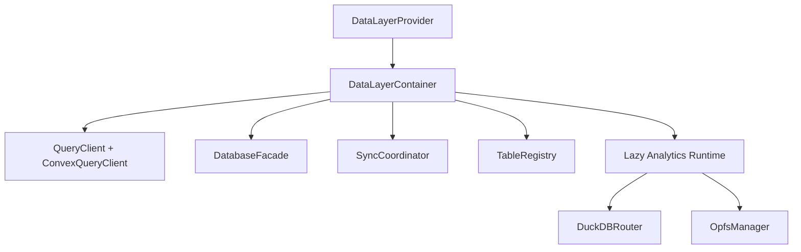

# Foundation Data Layer

`@open-insights-web/foundation-data-layer` is the runtime composition layer for data access in Open Insights.

It combines:
- Convex query/mutation execution
- Offline cache persistence via foundation-database
- Offline queueing and sync orchestration via foundation-sync-engine
- Optional analytics SQL execution via DuckDB bridge
- Background parquet sync for analytics tables

## Installation

```bash
npm install @open-insights-web/foundation-data-layer @tanstack/react-query convex
```

## Quick Start

```tsx
import { DataLayerProvider } from '@open-insights-web/foundation-data-layer';
import {
  CONFLICT_STRATEGY,
  DATA_FRESHNESS,
  type UnifiedTableConfig,
} from '@open-insights-web/foundation-data-model';

const tables: ReadonlyArray<UnifiedTableConfig> = [
  {
    name: 'events',
    convex: {
      list: api.events.list,
      get: api.events.get,
      create: api.events.create,
      update: api.events.update,
      delete: api.events.remove,
    },
    analytics: {
      enabled: true,
      freshness: DATA_FRESHNESS.NEAR_REALTIME,
    },
  },
];

export const AppProviders = ({ children }: { children: React.ReactNode }) => (
  <DataLayerProvider
    config={{
      convexUrl: import.meta.env.VITE_CONVEX_URL,
      conflictStrategy: CONFLICT_STRATEGY.LAST_WRITE_WINS,
      enableCrossTab: true,
      enableAnalytics: true,
      datasourceApi: api.datasource.list,
      tables,
    }}
  >
    {children}
  </DataLayerProvider>
);
```

## Configuration

`DataLayerConfig`:
- `convexUrl` (required)
- `tables` (`ReadonlyArray<UnifiedTableConfig>`)
- `datasourceApi` (Convex datasource query for background parquet sync)
- `conflictStrategy`
- `enableCrossTab` (default `true`)
- `enableAnalytics` (default `true`)
- `defaultStaleTime`
- `defaultGcTime`
- `cache` (`CacheConfig`)
- `axiosInstance` (shared transport instance for network-dependent paths)
- `debug`
- `onSyncError`

## Public API

Provider and context:
- `DataLayerProvider`
- `useDataLayer`
- `useDataLayerInternals` (advanced integrations)

Query hooks:
- `useDLGet`
- `useDLGetList`
- `useDLGetOne`

Mutation hooks:
- `useDLCreate`
- `useDLUpdate`
- `useDLDelete`

Analytics hooks:
- `useDLAnalytics`
- `useDLAnalyticsMutation`
- `useCreateAnalyticsView`
- `useDropAnalyticsView`
- `useExecuteAnalyticsSql`
- `useLoadParquetFile`
- `useCopyToParquet`

Sync/conflict hooks:
- `useSyncStatus`
- `useSyncTrigger`
- `useSyncEventListener`
- `useConflictResolution`
- `useEntityConflict`
- `useBackgroundFileSync`

Advanced composition:
- `DataLayerContainer`
- `createDataLayerContainer`
- `TableRegistry`
- `createTableRegistry`

## Architecture



Key design choices:
- Single container instance owns dependency lifecycle
- Analytics runtime initializes lazily on first analytics use
- Table registry is the single runtime source for table metadata
- Shared contracts (operations/freshness/conflict/table config) are defined in `foundation-data-model`

## Background Sync

`useBackgroundFileSync` flow:
1. Fetch datasource metadata
2. Compare remote table metadata with local metadata
3. Download changed parquet files with progress reporting
4. Persist file metadata
5. Invalidate analytics queries

The hook now normalizes table lists to avoid unnecessary reruns when callers pass a new array identity with equivalent table names.

## Performance Notes

- Optimistic mutation paths reuse shared helpers to reduce duplicate cache logic.
- File downloads support bounded concurrency with serialized OPFS writes.
- Download progress calculations are safe for zero-byte file metadata.

## Migration Notes (Major Redesign)

### Shared contracts moved to data-model
Import these from `@open-insights-web/foundation-data-model`:
- `OPERATIONS`, `READ_OPERATIONS`, `WRITE_OPERATIONS`
- `DATA_FRESHNESS`
- `CONFLICT_RESOLUTION_TYPE`
- `UnifiedTableConfig`, `TableAnalyticsConfig`

### Data-layer root exports simplified
`foundation-data-layer` no longer acts as the canonical export surface for shared operation/freshness/conflict contracts. Use data-model for those contracts.

### Query-engine alignment
`foundation-query-engine` now consumes the shared contract definitions from data-model, eliminating duplicated operation/freshness declarations.

## Contributing

Development guidelines:
- Keep strict TypeScript compatibility
- Keep data-layer hooks thin and move reusable logic into `src/utils`
- Prefer direct module imports over excessive barrel indirection
- Use axios (or injected `axiosInstance`) for HTTP operations

## Validation Commands

```bash
npx tsc -p libs/foundation/data-model/tsconfig.lib.json --noEmit
npx tsc -p libs/foundation/data-layer/tsconfig.lib.json --noEmit
npx tsc -p libs/foundation/query-engine/tsconfig.lib.json --noEmit
npx vitest run --config libs/foundation/data-layer/vite.config.mts
npx vitest run --config libs/foundation/query-engine/vite.config.mts
npx eslint libs/foundation/data-layer/src --ext .ts,.tsx,.js,.jsx --max-warnings=0
```
