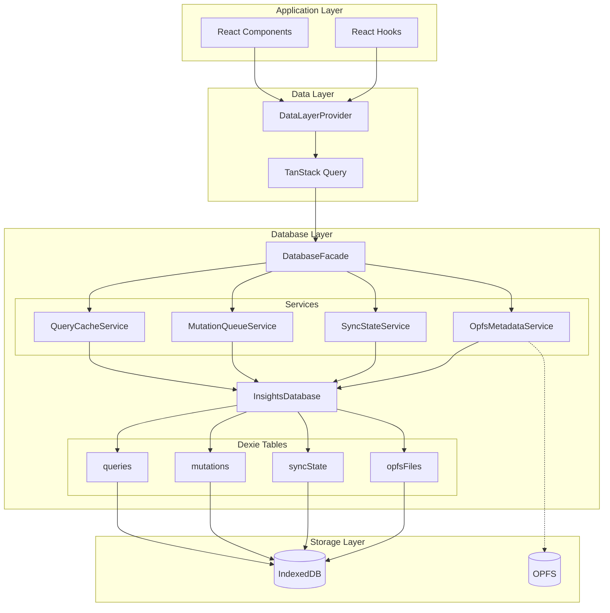
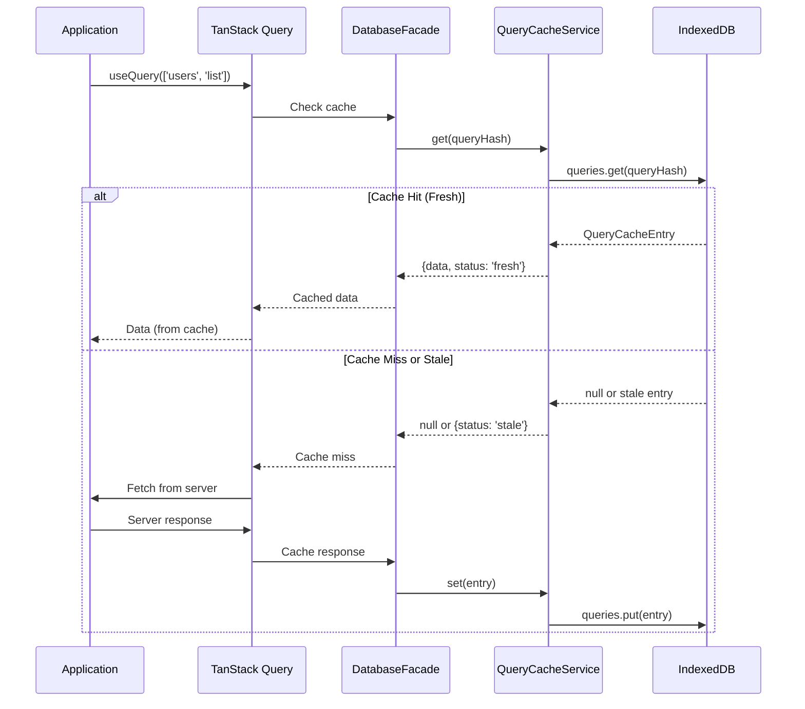
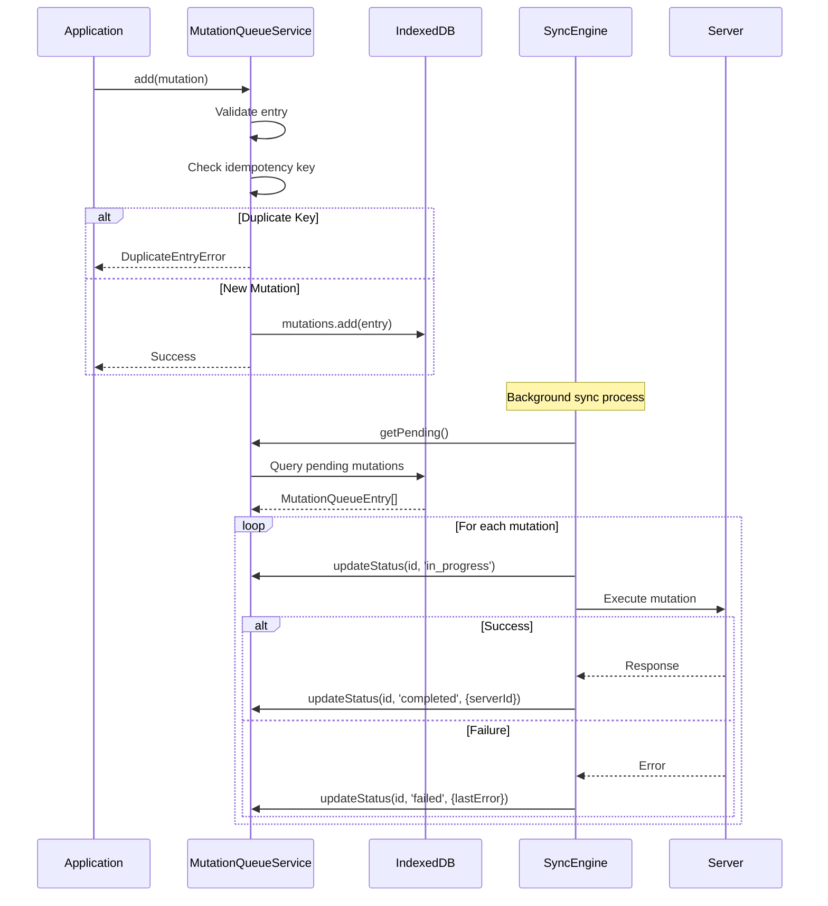
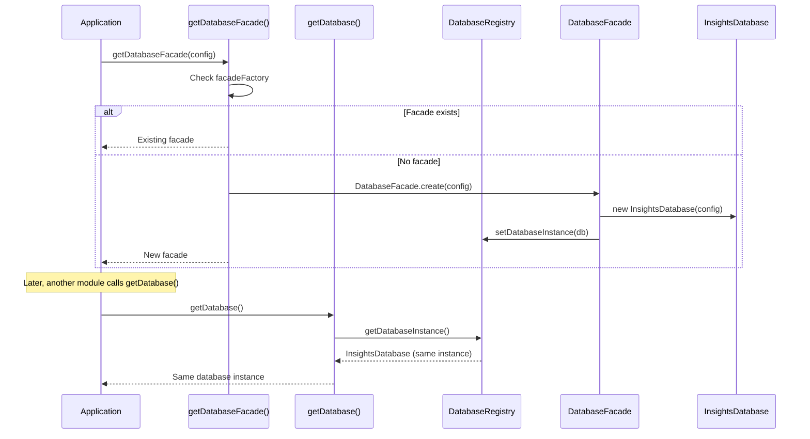
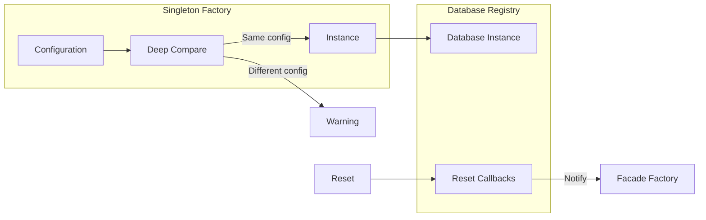
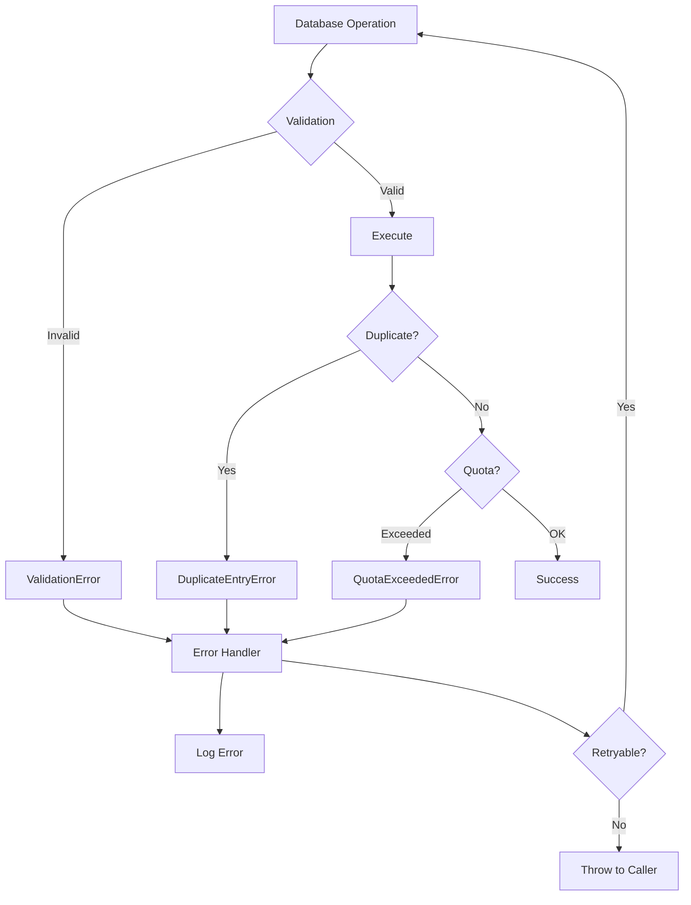

# @open-insights-web/foundation-database

A robust, enterprise-grade offline persistence layer using Dexie (IndexedDB) for offline-first applications. This library provides the foundational database infrastructure for caching, mutation queuing, sync state management, and OPFS file handling.

---

## Table of Contents

1. [Overview](#overview)
2. [Architecture](#architecture)
   - [High-Level Architecture](#high-level-architecture)
   - [Module Structure](#module-structure)
   - [Data Flow Diagrams](#data-flow-diagrams)
   - [Design Principles](#design-principles)
3. [Installation](#installation)
4. [Quick Start](#quick-start)
5. [Core Concepts](#core-concepts)
   - [Two Access Patterns](#1-two-access-patterns)
   - [Table Structure](#2-table-structure)
   - [Service Layer](#3-service-layer)
   - [Status Constants](#4-status-constants)
   - [Singleton Management](#5-singleton-management)
6. [API Reference](#api-reference)
   - [DatabaseFacade](#databasefacade)
   - [Tables](#tables)
   - [Services](#services)
   - [OPFS Manager](#opfs-manager)
   - [Validation](#validation)
   - [Errors](#errors)
   - [Utilities](#utilities)
7. [Configuration](#configuration)
8. [Integration with Foundation Libraries](#integration-with-foundation-libraries)
9. [Patterns and Best Practices](#patterns-and-best-practices)
10. [Performance Considerations](#performance-considerations)
11. [Error Handling](#error-handling)
12. [Testing](#testing)
13. [Troubleshooting](#troubleshooting)
14. [Migration Guide](#migration-guide)
15. [Security Considerations](#security-considerations)
16. [Edge Cases and Gotchas](#edge-cases-and-gotchas)
17. [Contributing](#contributing)
18. [License](#license)

---

## Overview

The `foundation-database` library is the persistence backbone of the Open Insights offline-first architecture. It provides:

- **Query Cache**: Persistent caching for TanStack Query with TTL and LRU eviction
- **Mutation Queue**: Offline mutation queue with idempotency, dependency tracking, and retry logic
- **Sync State**: Key-value store for tracking synchronization state across sessions
- **OPFS Metadata**: File metadata tracking for Origin Private File System (analytics data)
- **OPFS Manager**: Full OPFS file management with quota handling

### Key Features

| Feature | Description |
|---------|-------------|
| **Dexie-based** | Leverages Dexie for type-safe IndexedDB operations |
| **Offline-first** | Designed for apps that work without network connectivity |
| **Type-safe** | Full TypeScript support with strict typing |
| **Validated** | Zod schema validation for all data |
| **Singleton Pattern** | Thread-safe singleton management for database instances |
| **Auto-cleanup** | Automatic TTL-based and LRU cache eviction |
| **Error Handling** | Structured errors extending `FoundationError` |
| **Memory Efficient** | Uses streaming patterns to avoid loading large datasets into memory |

### Dependencies

```
@open-insights-web/foundation-data-model  - Types, error codes, branded types
@open-insights-web/foundation-utils       - Singleton factory, logging, utilities
dexie                                     - IndexedDB wrapper
zod                                       - Runtime validation
```

---

## Architecture

### High-Level Architecture



### Module Structure

```
libs/foundation/database/src/
├── index.ts              # Public API exports
├── internal.ts           # Internal foundation library exports
├── database.spec.ts      # Unit tests
│
├── core/                 # Core database implementation
│   ├── config.ts         # Configuration types and defaults
│   ├── database.ts       # InsightsDatabase class (Dexie)
│   ├── database-registry.ts  # Singleton coordination
│   └── index.ts
│
├── facade/               # Public facade pattern
│   ├── database-facade.ts    # DatabaseFacade class
│   └── index.ts
│
├── tables/               # Table type definitions and helpers
│   ├── query-cache.ts    # QueryCacheEntry type + helpers
│   ├── mutation-queue.ts # MutationQueueEntry type + helpers
│   ├── sync-state.ts     # SyncStateEntry type + helpers
│   ├── opfs-metadata.ts  # OpfsMetadataEntry type + helpers
│   └── index.ts
│
├── services/             # Service layer (business logic)
│   ├── base.ts           # BaseService abstract class
│   ├── query-cache.ts    # QueryCacheService
│   ├── mutation-queue.ts # MutationQueueService
│   ├── sync-state.ts     # SyncStateService
│   ├── opfs-metadata.ts  # OpfsMetadataService
│   └── index.ts
│
├── validation/           # Zod schemas and validators
│   ├── schemas.ts        # All Zod schemas
│   └── index.ts
│
├── errors/               # Error classes and type guards
│   ├── database-errors.ts
│   └── index.ts
│
├── opfs/                 # OPFS file manager
│   ├── manager.ts        # OpfsManager class
│   └── index.ts
│
└── utils/                # Utility functions
    ├── hash.ts           # Idempotency key generation
    └── index.ts
```

### Data Flow Diagrams

#### Query Cache Flow



#### Mutation Queue Flow



#### Singleton Coordination Flow



### Design Principles

1. **Single Source of Truth**: Types defined once in tables, used everywhere
2. **Separation of Concerns**: Tables define structure, Services handle logic
3. **Facade Pattern**: `DatabaseFacade` provides clean API hiding complexity
4. **Registry Pattern**: Coordinates multiple singletons (`InsightsDatabase` + `DatabaseFacade`)
5. **Validation First**: All data validated before writes using Zod schemas
6. **Proper Error Handling**: Typed errors with codes, not silent failures
7. **Memory Efficiency**: Uses streaming patterns (`each()`) for large datasets
8. **Idempotency**: Mutation queue uses idempotency keys to prevent duplicates

---

## Installation

The library is part of the Nx monorepo. Import directly:

```typescript
import {
  getDatabaseFacade,
  DatabaseFacade,
  // ... other exports
} from '@open-insights-web/foundation-database';
```

---

## Quick Start

### Basic Usage with DatabaseFacade (Recommended)

```typescript
import { getDatabaseFacade } from '@open-insights-web/foundation-database';

// Get singleton instance
const db = getDatabaseFacade();

// Cache a query result
await db.queries.set({
  queryHash: 'users-list-abc123',
  queryKey: ['users', 'list'],
  tableName: 'users',
  data: [{ id: '1', name: 'Alice' }],
  dataUpdatedAt: Date.now(),
  expiresAt: Date.now() + 5 * 60 * 1000, // 5 minutes
  schemaVersion: 1,
  isOfflineData: false,
});

// Retrieve cached data
const cached = await db.queries.get('users-list-abc123');
if (cached) {
  console.log('Cache status:', cached.status); // 'fresh' | 'stale' | 'expired'
  console.log('Data:', cached.data);
}

// Queue a mutation for offline processing
import { createMutationEntry, MutationType } from '@open-insights-web/foundation-database';

const mutation = createMutationEntry('mutation-123', {
  type: MutationType.CREATE,
  tableName: 'users',
  entityId: 'user-456',
  payload: { name: 'Bob', email: 'bob@example.com' },
  optimisticData: { id: 'user-456', name: 'Bob' },
});

await db.mutations.add(mutation);

// Get pending mutations
const pending = await db.mutations.getPending();
console.log(`${pending.length} mutations waiting to sync`);
```

### Configuration

```typescript
import { getDatabaseFacade } from '@open-insights-web/foundation-database';

const db = getDatabaseFacade({
  name: 'my-app-db',              // Database name (default: 'open-insights-db')
  version: 1,                     // Schema version
  debug: true,                    // Enable debug logging
  queryCacheTTL: 10 * 60 * 1000,  // Cache TTL: 10 minutes
  maxRetryAttempts: 5,            // Max mutation retries
  staleThreshold: 2 * 60 * 1000,  // Stale threshold: 2 minutes
  autoCleanup: true,              // Enable auto-cleanup
  cleanupInterval: 60 * 1000,     // Cleanup every minute
  maxCacheEntries: 500,           // LRU eviction threshold
});
```

---

## Core Concepts

### 1. Two Access Patterns

The library provides two ways to access the database:

| Pattern | Use Case | Access |
|---------|----------|--------|
| `DatabaseFacade` | Application code | `getDatabaseFacade()` |
| `InsightsDatabase` | Foundation libraries | `getDatabase()` |

Both share the same underlying database instance via the **Registry Pattern**.

```typescript
// Application code (recommended)
import { getDatabaseFacade } from '@open-insights-web/foundation-database';
const facade = getDatabaseFacade();

// Foundation libraries (internal)
import { getDatabase } from '@open-insights-web/foundation-database';
const db = getDatabase();

// Both access the SAME underlying database instance!
```

### 2. Table Structure

The database has four tables:

| Table | Primary Key | Purpose | Indexes |
|-------|-------------|---------|---------|
| `queries` | `queryHash` | TanStack Query cache | `tableName`, `dataUpdatedAt`, `expiresAt` |
| `mutations` | `id` | Offline mutation queue | `timestamp`, `status`, `idempotencyKey`, `*dependsOn` |
| `syncState` | `key` | Sync state key-value store | - |
| `opfsFiles` | `path` | OPFS file metadata | `tableName`, `lastModified` |

### 3. Service Layer

Each table has a corresponding service that implements business logic:

```typescript
interface DatabaseFacade {
  queries: QueryCacheService;        // QueryCacheOperations
  mutations: MutationQueueService;   // MutationQueueOperations
  syncState: SyncStateService;       // SyncStateOperations
  opfsMetadata: OpfsMetadataService; // OpfsMetadataOperations
}
```

### 4. Status Constants

```typescript
import { QueryCacheStatus, MutationStatus, MutationType } from '@open-insights-web/foundation-database';

// Query cache status
QueryCacheStatus.FRESH    // Data is fresh
QueryCacheStatus.STALE    // Data needs revalidation
QueryCacheStatus.EXPIRED  // Data has expired

// Mutation status
MutationStatus.PENDING        // Waiting to be processed
MutationStatus.IN_PROGRESS    // Currently processing
MutationStatus.COMPLETED      // Successfully completed
MutationStatus.FAILED         // Failed (may retry)
MutationStatus.OFFLINE_QUEUED // Queued while offline

// Mutation type
MutationType.CREATE  // Insert new record
MutationType.UPDATE  // Modify existing record
MutationType.DELETE  // Remove record
```

### 5. Singleton Management

The library uses `createSingletonFactory` from foundation-utils for thread-safe singleton management:



**Key behaviors:**
- First call creates the instance with provided config
- Subsequent calls return existing instance (config ignored with warning)
- `reset()` closes the instance and clears the singleton
- Registry ensures `DatabaseFacade` and `InsightsDatabase` stay in sync

---

## API Reference

### DatabaseFacade

The main entry point for application code.

#### Getting the Instance

```typescript
import {
  getDatabaseFacade,
  resetDatabaseFacade,
  hasDatabaseFacade,
} from '@open-insights-web/foundation-database';

// Get or create singleton
const db = getDatabaseFacade(config?);

// Reset (closes database, clears singleton)
await resetDatabaseFacade();

// Check if instance exists
const exists = hasDatabaseFacade();
```

#### Properties

| Property | Type | Description |
|----------|------|-------------|
| `queries` | `QueryCacheService` | Query cache operations |
| `mutations` | `MutationQueueService` | Mutation queue operations |
| `syncState` | `SyncStateService` | Sync state operations |
| `opfsMetadata` | `OpfsMetadataService` | OPFS metadata operations |
| `config` | `DatabaseConfig` | Database configuration |

#### Methods

| Method | Signature | Description |
|--------|-----------|-------------|
| `getStats` | `() => Promise<DatabaseStats>` | Get database statistics |
| `clearAll` | `() => Promise<void>` | Clear all data from all tables |
| `startCleanup` | `() => void` | Start auto-cleanup of expired data |
| `stopCleanup` | `() => void` | Stop auto-cleanup |
| `cleanup` | `() => Promise<number>` | Run cleanup manually, returns deleted count |
| `close` | `() => void` | Close the database connection |
| `getDatabase` | `() => InsightsDatabase` | Get underlying database instance |
| `transaction` | `<T>(mode, tables, fn) => Promise<T>` | Execute atomic transaction |

#### Transaction Example

```typescript
const db = getDatabaseFacade();

// Atomic update across multiple tables
await db.transaction('rw', ['queries', 'mutations'], async () => {
  await db.queries.set(cacheEntry);
  await db.mutations.add(mutationEntry);
  // If either fails, both are rolled back
});
```

---

### Tables

#### QueryCacheEntry

Stores cached query results from TanStack Query.

```typescript
interface QueryCacheEntry<TData = JsonValue> {
  queryHash: string;      // Primary key - hash of query key
  queryKey: QueryKeyBase; // Original query key array
  tableName: string;      // Table/entity name (indexed)
  data: TData;            // Cached response data
  dataUpdatedAt: number;  // When data was last updated
  expiresAt: number;      // Expiration timestamp (indexed)
  schemaVersion: number;  // Schema version when cached
  isOfflineData: boolean; // Whether data came from offline storage
  etag?: string;          // Server ETag for revalidation
}
```

**Helper Functions:**

```typescript
import {
  createCacheEntry,
  isCacheExpired,
  isCacheStale,
  getCacheStatus,
} from '@open-insights-web/foundation-database';

// Create a new cache entry
const entry = createCacheEntry(
  'query-hash-abc123',      // queryHash
  ['users', 'list'],        // queryKey
  userData,                 // data
  {
    tableName: 'users',
    ttl: 5 * 60 * 1000,     // 5 minutes
    schemaVersion: 1,
    isOfflineData: false,
    etag: 'W/"abc123"',
  }
);

// Check status
const expired = isCacheExpired(entry);           // boolean
const stale = isCacheStale(entry, 60000);        // boolean (1 minute threshold)
const status = getCacheStatus(entry, 60000);     // 'fresh' | 'stale' | 'expired'
```

#### MutationQueueEntry

Stores mutations for offline-first processing.

```typescript
interface MutationQueueEntry<TPayload = JsonValue> {
  id: string;                 // Primary key - unique mutation ID
  idempotencyKey: string;     // Prevents duplicate processing (indexed)
  timestamp: number;          // Creation timestamp (indexed)
  status: MutationStatus;     // Current status (indexed)
  type: MutationType;         // CREATE | UPDATE | DELETE
  tableName: string;          // Target table
  entityId: string;           // Entity ID (may be provisional)
  payload: TPayload;          // Mutation data
  optimisticData?: TPayload;  // Data applied to cache optimistically
  previousData?: TPayload;    // Previous data for rollback
  retryCount: number;         // Number of retry attempts
  lastError?: string;         // Last error message
  serverId?: string;          // Server-assigned ID after sync
  invalidateKeys?: string[];  // Query keys to invalidate on success
  dependsOn?: string[];       // Mutation IDs this depends on (multi-entry index)
  conflictStrategy?: ConflictStrategy; // Conflict resolution strategy
}
```

**Helper Functions:**

```typescript
import {
  createMutationEntry,
  canProcessMutation,
  shouldRetry,
  prepareForRetry,
  MutationType,
} from '@open-insights-web/foundation-database';
import { ConflictStrategy } from '@open-insights-web/foundation-data-model';

// Create a mutation
const mutation = createMutationEntry('mut-123', {
  type: MutationType.UPDATE,
  tableName: 'users',
  entityId: 'user-456',
  payload: { name: 'Updated Name' },
  previousData: { name: 'Old Name' },
  invalidateKeys: ['users-list'],
  dependsOn: ['mut-100', 'mut-101'], // Must complete first
  conflictStrategy: ConflictStrategy.LAST_WRITE_WINS,
});

// Check if mutation can be processed (dependencies met)
const completedIds = new Set(['mut-100', 'mut-101']);
const canProcess = canProcessMutation(mutation, completedIds); // true

// Retry logic
const shouldTryAgain = shouldRetry(mutation, 3); // maxRetries = 3
const retryMutation = prepareForRetry(mutation, 'Network error');
```

#### SyncStateEntry

Key-value store for synchronization state.

```typescript
interface SyncStateEntry<TValue = JsonValue> {
  key: string;       // Primary key
  value: TValue;     // State value
  updatedAt: number; // Last update timestamp
}

// Predefined keys
const SYNC_STATE_KEYS = {
  LAST_SYNC: 'lastSync',
  NETWORK_STATUS: 'networkStatus',
  PENDING_COUNT: 'pendingCount',
  DUCKDB_VIEWS: 'duckdbViews',
  SCHEMA_VERSION: 'schemaVersion',
  CONFLICTS: 'conflicts',
  ID_MAPPINGS: 'idMappings',
} as const;
```

**Typed Values:**

```typescript
// Network status (import from @foundation/data-model)
import { NetworkStatus } from '@open-insights-web/foundation-data-model';

interface NetworkStatus {
  isOnline: boolean;
  lastOnlineAt: number | null;
  lastOfflineAt: number | null;
  connectionType?: string;
}

// DuckDB views state
interface DuckDBViewsValue {
  views: Array<{
    name: string;
    sql: string;
    dependencies: string[];
  }>;
  lastUpdatedAt: number;
}

// Last sync state
interface LastSyncValue {
  timestamp: number;
  tables: Record<string, number>;
}
```

#### OpfsMetadataEntry

Tracks files stored in Origin Private File System.

```typescript
interface OpfsMetadataEntry {
  path: string;             // Primary key - file path in OPFS
  tableName: string;        // Associated table name (indexed)
  fileType: OpfsFileType;   // File type
  sizeBytes: number;        // File size
  lastModified: number;     // Last modified timestamp (indexed)
  contentHash?: string;     // Content hash for change detection
  rowCount?: number;        // Row count (for data files)
  schema?: OpfsFileSchema;  // Column schema
  isRegistered: boolean;    // Whether registered in DuckDB
  viewName?: string;        // DuckDB view name if view definition
  dependencies?: string[];  // Files this depends on
}

// File types
const OpfsFileType = {
  PARQUET: 'parquet',
  JSON: 'json',
  CSV: 'csv',
  VIEW_DEFINITION: 'view_definition',
} as const;
```

---

### Services

#### QueryCacheService

```typescript
interface QueryCacheOperations {
  // Single operations
  get(queryHash: string, options?: GetCacheOptions): Promise<QueryCacheEntryWithStatus | null>;
  set(entry: QueryCacheEntry): Promise<void>;
  delete(queryHash: string): Promise<void>;
  deleteByTable(tableName: string): Promise<number>;
  deleteExpired(): Promise<number>;
  getByTable(tableName: string): Promise<QueryCacheEntry[]>;
  hasFresh(queryHash: string): Promise<boolean>;
  count(): Promise<number>;
  clear(): Promise<void>;

  // Bulk operations
  bulkGet(queryHashes: string[], options?: GetCacheOptions): Promise<(QueryCacheEntryWithStatus | null)[]>;
  bulkSet(entries: QueryCacheEntry[]): Promise<void>;
  bulkDelete(queryHashes: string[]): Promise<number>;
}

interface GetCacheOptions {
  maxAge?: number;       // Max age in ms before considering stale
  returnStale?: boolean; // Whether to return stale/expired data
}
```

**Return Value Convention:**
- Returns `null` when entry doesn't exist or is invalid
- Returns entry with `status` field when found

**Example:**

```typescript
const db = getDatabaseFacade();

// Get with options
const entry = await db.queries.get('hash', {
  maxAge: 30000,       // Consider stale after 30s
  returnStale: true,   // Return even if stale
});

// Bulk operations for efficiency
const entries = await db.queries.bulkGet(['hash1', 'hash2', 'hash3']);
await db.queries.bulkSet([entry1, entry2, entry3]);

// Invalidate by table
const deleted = await db.queries.deleteByTable('users');
console.log(`Invalidated ${deleted} cache entries for users table`);
```

#### MutationQueueService

```typescript
interface MutationQueueOperations {
  // Add mutations
  add(entry: MutationQueueEntry): Promise<void>;        // Throws on duplicate
  addIfNotExists(entry: MutationQueueEntry): Promise<boolean>; // Silent on duplicate

  // Retrieve
  get(id: string): Promise<MutationQueueEntry | undefined>;
  getPending(): Promise<MutationQueueEntry[]>;          // PENDING + OFFLINE_QUEUED
  getByStatus(status: MutationStatus): Promise<MutationQueueEntry[]>;
  findByIdempotencyKey(key: string): Promise<MutationQueueEntry | undefined>;

  // Update
  updateStatus(id: string, status: MutationStatus, updates?: Partial<MutationQueueEntry>): Promise<void>;
  markAllOfflineQueued(): Promise<number>;

  // Delete
  delete(id: string): Promise<void>;
  deleteCompleted(): Promise<number>;

  // Stats
  countByStatus(status: MutationStatus): Promise<number>;
  count(): Promise<number>;
  clear(): Promise<void>;

  // Bulk operations
  bulkGet(ids: string[]): Promise<(MutationQueueEntry | undefined)[]>;
  bulkAdd(entries: MutationQueueEntry[]): Promise<void>;
  bulkDelete(ids: string[]): Promise<number>;
}
```

**Return Value Convention:**
- Returns `undefined` when mutation doesn't exist

**Example:**

```typescript
const db = getDatabaseFacade();

// Add mutation with idempotency protection
const added = await db.mutations.addIfNotExists(mutation);
if (!added) {
  console.log('Duplicate mutation ignored');
}

// Process pending mutations
const pending = await db.mutations.getPending();
for (const mutation of pending) {
  await db.mutations.updateStatus(mutation.id, MutationStatus.IN_PROGRESS);
  try {
    await processOnServer(mutation);
    await db.mutations.updateStatus(mutation.id, MutationStatus.COMPLETED, {
      serverId: 'server-assigned-id',
    });
  } catch (error) {
    await db.mutations.updateStatus(mutation.id, MutationStatus.FAILED, {
      lastError: error.message,
    });
  }
}

// Cleanup completed mutations
const cleaned = await db.mutations.deleteCompleted();
```

#### SyncStateService

```typescript
interface SyncStateOperations {
  // Generic operations
  get<T>(key: SyncStateKey, options: GetStateOptions<T>): Promise<T | undefined>;
  getRaw(key: SyncStateKey): Promise<unknown>;
  set<T>(key: SyncStateKey, value: T): Promise<void>;
  delete(key: SyncStateKey): Promise<void>;
  getAll(): Promise<SyncStateEntry[]>;
  clear(): Promise<void>;

  // Typed convenience methods (use Zod validation)
  getLastSync(): Promise<LastSyncValue | undefined>;
  setLastSync(value: LastSyncValue): Promise<void>;
  getNetworkStatus(): Promise<NetworkStatus | undefined>;
  setNetworkStatus(value: NetworkStatus): Promise<void>;
  getDuckDBViews(): Promise<DuckDBViewsValue | undefined>;
  setDuckDBViews(value: DuckDBViewsValue): Promise<void>;
  getPendingCount(): Promise<number>;
  setPendingCount(count: number): Promise<void>;
  getSchemaVersion(): Promise<number>;
  setSchemaVersion(version: number): Promise<void>;
}
```

**Example:**

```typescript
const db = getDatabaseFacade();

// Use typed convenience methods (recommended)
const networkStatus = await db.syncState.getNetworkStatus();
await db.syncState.setNetworkStatus({
  isOnline: true,
  lastOnlineAt: Date.now(),
  lastOfflineAt: null,
});

// Or use generic method with schema
import { z } from 'zod';

const customSchema = z.object({
  foo: z.string(),
  bar: z.number(),
});

const value = await db.syncState.get('customKey', {
  schema: customSchema,
});
```

#### OpfsMetadataService

```typescript
interface OpfsMetadataOperations {
  get(path: string): Promise<OpfsMetadataEntry | undefined>;
  set(entry: OpfsMetadataEntry): Promise<void>;
  delete(path: string): Promise<void>;
  getByTable(tableName: string): Promise<OpfsMetadataEntry[]>;
  getRegistered(): Promise<OpfsMetadataEntry[]>;
  getViews(): Promise<OpfsMetadataEntry[]>;
  markRegistered(path: string): Promise<void>;
  markUnregistered(path: string): Promise<void>;
  markAllUnregistered(): Promise<void>;
  getInDependencyOrder(): Promise<OpfsMetadataEntry[]>;  // Topological sort
  getTotalSize(): Promise<number>;
  count(): Promise<number>;
  exists(path: string): Promise<boolean>;
  clear(): Promise<void>;
}
```

---

### OPFS Manager

Manages actual files in the Origin Private File System.

```typescript
import {
  OpfsManager,
  getOpfsManager,
  resetOpfsManager,
  hasOpfsManager,
} from '@open-insights-web/foundation-database';

// Configuration
interface OpfsManagerConfig {
  database?: InsightsDatabase;   // Database instance
  rootDir?: string;              // Root directory (default: 'open-insights')
  debug?: boolean;               // Enable debug logging
  onError?: LegacyErrorCallback; // Error handler
}

// Get singleton
const manager = getOpfsManager(config?);

// Check OPFS support
if (OpfsManager.isSupported()) {
  await manager.initialize();
}

// File operations
const metadata = await manager.writeFile(
  'analytics/users.parquet',
  parquetData,
  {
    tableName: 'users',
    fileType: OpfsFileType.PARQUET,
    rowCount: 1000,
    schema: {
      columns: [
        { name: 'id', type: 'VARCHAR', nullable: false },
        { name: 'name', type: 'VARCHAR', nullable: true },
      ],
    },
  }
);

const data = await manager.readFile('analytics/users.parquet');
const text = await manager.readFileAsText('analytics/config.json');
const exists = await manager.exists('analytics/users.parquet');
await manager.deleteFile('analytics/users.parquet');

// List and manage
const files = await manager.listDirectory('analytics');
const registeredFiles = await manager.getRegisteredFilesInOrder();
const totalSize = await manager.getTotalSize();

// DuckDB registration tracking
await manager.markRegistered('analytics/users.parquet');
await manager.markUnregistered('analytics/users.parquet');
await manager.markAllUnregistered(); // After DuckDB restart

// Cleanup
await manager.clear();
await manager.dispose();
```

---

### Validation

All data is validated using Zod schemas before writes.

```typescript
import {
  // Schemas
  queryCacheEntrySchema,
  mutationQueueEntrySchema,
  opfsMetadataEntrySchema,
  syncStateEntrySchema,
  lastSyncValueSchema,
  networkStatusSchema,
  duckDBViewsValueSchema,

  // Factory
  createValidator,

  // Pre-built validators (return Result<T, ZodValidationError>)
  validateQueryCacheEntry,
  validateMutationQueueEntry,
  validateOpfsMetadataEntry,
  validateSyncStateEntry,
  validateLastSyncValue,
  validateNetworkStatus,
  validateDuckDBViewsValue,

  // Error class
  ZodValidationError,
} from '@open-insights-web/foundation-database';

// Using pre-built validators
const result = validateQueryCacheEntry(data);
if (result.ok) {
  console.log('Valid:', result.value);
} else {
  console.error('Invalid:', result.error.message);
}

// Creating custom validators
import { z } from 'zod';

const mySchema = z.object({
  name: z.string().min(1),
  count: z.number().positive(),
});

const validateMyType = createValidator(mySchema);
const result = validateMyType(data);
```

---

### Errors

All errors extend `FoundationError` from `@foundation/data-model`.

```typescript
import {
  // Error classes
  DatabaseError,           // Base class for all database errors
  QuotaExceededError,      // Storage quota exceeded
  OpfsNotSupportedError,   // OPFS not supported
  OpfsInitFailedError,     // OPFS initialization failed
  ValidationError,         // Data validation failed
  ConfigInvalidError,      // Invalid configuration
  NotInitializedError,     // Component not initialized
  DuplicateEntryError,     // Duplicate idempotency key

  // Factory functions
  createQuotaExceededError,
  createOpfsNotSupportedError,
  createOpfsInitFailedError,
  createValidationError,
  createConfigInvalidError,
  createNotInitializedError,
  createDuplicateEntryError,

  // Type guards
  isDatabaseError,
  isQuotaExceededError,
} from '@open-insights-web/foundation-database';

// Import hasErrorCode from foundation-data-model
import { hasErrorCode, FoundationErrorCode } from '@open-insights-web/foundation-data-model';
```

**Error Codes:**

| Error | Code | Retryable |
|-------|------|-----------|
| `QuotaExceededError` | `DATABASE_QUOTA_EXCEEDED` | No |
| `OpfsNotSupportedError` | `DATABASE_OPFS_NOT_SUPPORTED` | No |
| `OpfsInitFailedError` | `DATABASE_OPFS_INIT_FAILED` | Yes |
| `ValidationError` | `VALIDATION_FAILED` | No |
| `ConfigInvalidError` | `CONFIG_INVALID` | No |
| `NotInitializedError` | `DATABASE_NOT_INITIALIZED` | Yes |
| `DuplicateEntryError` | `DATABASE_DUPLICATE_ENTRY` | No |

---

### Utilities

#### Idempotency Key Generation

```typescript
import {
  generateIdempotencyKey,
  generateIdempotencyKeyAsync,
} from '@open-insights-web/foundation-database';

// Synchronous (uses djb2 hash)
const key = generateIdempotencyKey({
  tableName: 'users',
  entityId: 'user-123',
  payload: { name: 'Alice' },
});
// Returns: "users:user-123:abc123def"

// With custom key
const customKey = generateIdempotencyKey({
  tableName: 'users',
  entityId: 'user-123',
  payload: { name: 'Alice' },
  customKey: 'my-custom-key',
});
// Returns: "my-custom-key"

// Async (uses SHA-256)
const asyncKey = await generateIdempotencyKeyAsync({
  tableName: 'users',
  entityId: 'user-123',
  payload: { name: 'Alice' },
});
```

---

## Configuration

### DatabaseConfig

```typescript
interface DatabaseConfig {
  name: string;            // Database name (default: 'open-insights-db')
  version: number;         // Schema version (default: 1)
  debug: boolean;          // Enable debug logging (default: dev only)
  queryCacheTTL: number;   // Cache TTL in ms (default: 5 minutes)
  maxRetryAttempts: number;// Max mutation retries (default: 3)
  staleThreshold: number;  // Stale threshold in ms (default: 1 minute)
  autoCleanup: boolean;    // Enable auto cleanup (default: true)
  cleanupInterval: number; // Cleanup interval in ms (default: 1 minute)
  maxCacheEntries: number; // LRU eviction threshold (default: 1000)
}
```

**Default Values:**

```typescript
import { TIME_MS } from '@open-insights-web/foundation-utils';

const DEFAULT_DATABASE_CONFIG: DatabaseConfig = {
  name: 'open-insights-db',
  version: 1,
  debug: process.env.NODE_ENV === 'development',
  queryCacheTTL: TIME_MS.MINUTE * 5,      // 5 minutes
  maxRetryAttempts: 3,
  staleThreshold: TIME_MS.MINUTE,         // 1 minute
  autoCleanup: true,
  cleanupInterval: TIME_MS.MINUTE,        // 1 minute
  maxCacheEntries: 1000,
};
```

---

## Integration with Foundation Libraries

### With foundation-data-model

```typescript
// Types come from data-model
import type {
  JsonValue,
  QueryKeyBase,
  ConflictStrategy,
} from '@open-insights-web/foundation-data-model';

// NetworkStatus should be imported from data-model
import type { NetworkStatus } from '@open-insights-web/foundation-data-model';

// Error infrastructure
import {
  FoundationError,
  FoundationErrorCode,
  isFoundationError,
  hasErrorCode,
} from '@open-insights-web/foundation-data-model';

// Result type for validation
import { Result } from '@open-insights-web/foundation-data-model';
```

### With foundation-utils

```typescript
// Singleton management
import {
  createSingletonFactory,
  createDeepEqualComparison,
} from '@open-insights-web/foundation-utils';

// Logging
import { createDebugLogger } from '@open-insights-web/foundation-utils';

// Timer utilities
import { ManagedInterval, TIME_MS } from '@open-insights-web/foundation-utils';

// Hash functions
import { hashPayloadSync, hashPayloadAsync } from '@open-insights-web/foundation-utils';

// OPFS utilities
import {
  isOpfsSupported,
  getOpfsRootDirectory,
} from '@open-insights-web/foundation-utils';

// Algorithm utilities
import {
  topologicalSort,
  hasCircularDependency,
} from '@open-insights-web/foundation-utils';
```

### With foundation-sync-engine

The sync engine uses this database for:
- Persisting mutation queue
- Tracking network status
- Managing sync state
- Caching query results

```typescript
import {
  getDatabase,
  MutationStatus,
  type MutationQueueEntry,
} from '@open-insights-web/foundation-database';
import type { NetworkStatus } from '@open-insights-web/foundation-data-model';
```

### With foundation-bridge

The bridge uses this database for:
- OPFS file metadata tracking
- DuckDB view state persistence
- Sync state for analytics

```typescript
import {
  OpfsManager,
  getOpfsManager,
  OpfsNotSupportedError,
  type OpfsMetadataEntry,
  type DuckDBViewsValue,
} from '@open-insights-web/foundation-database';
```

---

## Patterns and Best Practices

### 1. Always Use the Facade

```typescript
// GOOD - Use the facade for application code
const db = getDatabaseFacade();
await db.queries.set(entry);

// AVOID - Direct database access (except in foundation libraries)
const db = getDatabase();
await db.queries.put(entry);
```

### 2. Validate Before Operations

```typescript
// Services validate automatically, but for manual operations:
import { validateMutationQueueEntry } from '@open-insights-web/foundation-database';

const result = validateMutationQueueEntry(entry);
if (!result.ok) {
  throw new Error(`Invalid mutation: ${result.error.message}`);
}
```

### 3. Use Transactions for Atomicity

```typescript
const db = getDatabaseFacade();

// Atomic operations across tables
await db.transaction('rw', ['queries', 'mutations'], async () => {
  await db.queries.delete(queryHash);
  await db.mutations.add(mutation);
});
```

### 4. Handle Errors Properly

```typescript
import { isDatabaseError, isQuotaExceededError } from '@open-insights-web/foundation-database';
import { hasErrorCode, FoundationErrorCode } from '@open-insights-web/foundation-data-model';

try {
  await db.mutations.add(mutation);
} catch (error) {
  if (hasErrorCode(error, FoundationErrorCode.DATABASE_DUPLICATE_ENTRY)) {
    // Handle duplicate - not an error, just skip
    return;
  }
  if (isQuotaExceededError(error)) {
    // Clear old data and retry
    await db.cleanup();
    await db.mutations.add(mutation);
    return;
  }
  // Re-throw unexpected errors
  throw error;
}
```

### 5. Cleanup on Logout

```typescript
const handleLogout = async () => {
  const db = getDatabaseFacade();
  
  // Clear all user data
  await db.clearAll();
  
  // Reset OPFS
  const opfs = getOpfsManager();
  await opfs.clear();
  
  // Reset singletons
  await resetDatabaseFacade();
  await resetOpfsManager();
};
```

### 6. Use Idempotency Keys

```typescript
import { generateIdempotencyKey } from '@open-insights-web/foundation-database';

// Idempotency key is generated from payload - same payload = same key
const key = generateIdempotencyKey({
  tableName: 'users',
  entityId: 'user-123',
  payload: { name: 'Alice' },
});

// Or provide custom key for special cases
const customKey = generateIdempotencyKey({
  tableName: 'users',
  entityId: 'user-123',
  payload: { name: 'Alice' },
  customKey: 'my-custom-idempotency-key',
});
```

### 7. Check OPFS Support

```typescript
import { OpfsManager } from '@open-insights-web/foundation-database';

if (OpfsManager.isSupported()) {
  const opfs = getOpfsManager();
  await opfs.initialize();
  // Use OPFS features
} else {
  // Fall back to API-only mode
  console.warn('OPFS not supported - analytics disabled');
}
```

---

## Performance Considerations

### 1. Use Bulk Operations

```typescript
// SLOW - Multiple round trips
for (const entry of entries) {
  await db.queries.set(entry);
}

// FAST - Single round trip
await db.queries.bulkSet(entries);
```

### 2. Use Indexed Queries

```typescript
// SLOW - Full table scan
const entries = await db.opfsMetadata.getAll();
const views = entries.filter(e => e.fileType === 'view_definition');

// FAST - Uses index (getViews uses filter but on indexed data)
const views = await db.opfsMetadata.getViews();
```

### 3. Use `each()` for Large Datasets

```typescript
// BAD - Loads all records into memory
const files = await this.db.opfsFiles.toArray();
const total = files.reduce((sum, f) => sum + f.sizeBytes, 0);

// GOOD - Streams records one at a time
let total = 0;
await this.db.opfsFiles.each((file) => {
  total += file.sizeBytes;
});
```

### 4. Configure Appropriate Cache Limits

```typescript
const db = getDatabaseFacade({
  maxCacheEntries: 500,    // Smaller for memory-constrained devices
  cleanupInterval: 30000,  // More frequent cleanup
});
```

### 5. Use Appropriate TTL

```typescript
// Short TTL for frequently changing data
const entry = createCacheEntry(hash, key, data, {
  tableName: 'notifications',
  ttl: TIME_MS.MINUTE,  // 1 minute
  schemaVersion: 1,
});

// Long TTL for static data
const entry = createCacheEntry(hash, key, data, {
  tableName: 'settings',
  ttl: TIME_MS.DAY,  // 24 hours
  schemaVersion: 1,
});
```

---

## Error Handling

### Error Handling Flow



### Recommended Error Handling Pattern

```typescript
import { isDatabaseError, isQuotaExceededError } from '@open-insights-web/foundation-database';
import { 
  hasErrorCode, 
  FoundationErrorCode,
  isFoundationError,
  getErrorCategory,
  ErrorCategory,
} from '@open-insights-web/foundation-data-model';

const handleDatabaseOperation = async <T>(
  operation: () => Promise<T>,
  options: { maxRetries?: number; onError?: (error: unknown) => void } = {}
): Promise<T> => {
  const { maxRetries = 3, onError } = options;
  let lastError: unknown;

  for (let attempt = 0; attempt < maxRetries; attempt++) {
    try {
      return await operation();
    } catch (error) {
      lastError = error;
      onError?.(error);

      // Don't retry non-retryable errors
      if (isFoundationError(error)) {
        const category = getErrorCategory(error);
        if (category === ErrorCategory.USER_INPUT || 
            category === ErrorCategory.PERMANENT) {
          throw error;
        }
      }

      // Handle specific errors
      if (hasErrorCode(error, FoundationErrorCode.DATABASE_DUPLICATE_ENTRY)) {
        // Duplicate is not an error - return silently
        return undefined as T;
      }

      if (isQuotaExceededError(error)) {
        // Try cleanup and retry
        const db = getDatabaseFacade();
        await db.cleanup();
        continue;
      }

      // Exponential backoff for transient errors
      await new Promise(r => setTimeout(r, Math.pow(2, attempt) * 100));
    }
  }

  throw lastError;
};
```

---

## Testing

### Running Tests

```bash
# Run unit tests
nx test foundation-database

# Run with coverage
nx test foundation-database --coverage

# Watch mode
nx test foundation-database --watch
```

### Testing with Fake IndexedDB

Tests use `fake-indexeddb` to simulate IndexedDB:

```typescript
import 'fake-indexeddb/auto';
import { getDatabaseFacade, resetDatabaseFacade } from '@open-insights-web/foundation-database';

describe('MyComponent', () => {
  beforeEach(async () => {
    await resetDatabaseFacade();
  });

  it('should cache data', async () => {
    const db = getDatabaseFacade({ debug: false });
    await db.queries.set(entry);
    const cached = await db.queries.get(entry.queryHash);
    expect(cached?.data).toEqual(entry.data);
  });
});
```

### Mocking the Database

```typescript
import { vi } from 'vitest';

// Mock entire module
vi.mock('@open-insights-web/foundation-database', () => ({
  getDatabaseFacade: vi.fn(() => ({
    queries: {
      get: vi.fn().mockResolvedValue(null),
      set: vi.fn().mockResolvedValue(undefined),
    },
    mutations: {
      add: vi.fn().mockResolvedValue(undefined),
      getPending: vi.fn().mockResolvedValue([]),
    },
  })),
}));
```

### Testing Error Scenarios

```typescript
import { createDuplicateEntryError } from '@open-insights-web/foundation-database';

it('should handle duplicate entry error', async () => {
  const db = getDatabaseFacade();
  
  // First add succeeds
  await db.mutations.add(mutation);
  
  // Second add throws DuplicateEntryError
  await expect(db.mutations.add(mutation)).rejects.toThrow();
  
  // Or use addIfNotExists
  const added = await db.mutations.addIfNotExists(mutation);
  expect(added).toBe(false);
});
```

---

## Troubleshooting

### Common Issues

#### 1. "Database instance already exists with different configuration"

**Cause**: Calling `getDatabaseFacade()` with different configs.

**Solution**: Call `resetDatabaseFacade()` before changing configuration:

```typescript
await resetDatabaseFacade();
const db = getDatabaseFacade(newConfig);
```

#### 2. "OPFS is not supported in this environment"

**Cause**: Browser doesn't support Origin Private File System.

**Solution**: Check support before using:

```typescript
if (OpfsManager.isSupported()) {
  // Use OPFS
} else {
  // Fall back to alternative
}
```

#### 3. "QuotaExceededError: Storage quota exceeded"

**Cause**: IndexedDB or OPFS storage limit reached.

**Solution**: 
1. Run cleanup: `await db.cleanup()`
2. Clear old data: `await db.mutations.deleteCompleted()`
3. Reduce cache limits in config

#### 4. Mutations not processing in order

**Cause**: Dependencies not set correctly.

**Solution**: Use `dependsOn` field:

```typescript
const mutation2 = createMutationEntry('mut-2', {
  ...options,
  dependsOn: ['mut-1'], // Wait for mut-1 to complete
});
```

#### 5. Cache returning stale data

**Cause**: TTL or stale threshold too long.

**Solution**: Adjust configuration:

```typescript
const db = getDatabaseFacade({
  queryCacheTTL: TIME_MS.MINUTE,      // Shorter TTL
  staleThreshold: TIME_MS.SECOND * 30, // Shorter stale threshold
});
```

### Debug Mode

Enable debug logging for troubleshooting:

```typescript
const db = getDatabaseFacade({ debug: true });
// Now all operations log to console
```

### Inspecting IndexedDB

Use browser DevTools:
1. Open DevTools (F12)
2. Go to Application tab
3. Expand IndexedDB
4. Find `open-insights-db`
5. Inspect tables: `queries`, `mutations`, `syncState`, `opfsFiles`

---

## Migration Guide

### Database Migrations

Database migrations are handled via Dexie's versioning system:

```typescript
// In core/database.ts

// Version 1: Initial schema
this.version(1).stores({
  queries: 'queryHash, tableName, dataUpdatedAt, expiresAt',
  mutations: 'id, timestamp, status, idempotencyKey, *dependsOn',
  opfsFiles: 'path, tableName, lastModified',
  syncState: 'key',
});

// Version 2: Adding a new index
this.version(2).stores({
  queries: 'queryHash, tableName, dataUpdatedAt, expiresAt, newIndex',
  mutations: 'id, timestamp, status, idempotencyKey, *dependsOn',
  opfsFiles: 'path, tableName, lastModified',
  syncState: 'key',
}).upgrade(async (tx) => {
  // Migration logic for existing data
  await tx.table('queries').toCollection().modify(entry => {
    if (entry.newColumn === undefined) {
      entry.newColumn = 'defaultValue';
    }
  });
});
```

### Breaking Changes Checklist

When introducing breaking changes:

1. [ ] Increment schema version in `DatabaseConfig`
2. [ ] Add migration in `database.ts`
3. [ ] Update types in `tables/*.ts`
4. [ ] Update validation schemas in `validation/schemas.ts`
5. [ ] Test migration path with existing data
6. [ ] Update this README

---

## Security Considerations

### 1. Data at Rest

IndexedDB data is stored unencrypted on disk. For sensitive data:

```typescript
// Encrypt before storing
import { encrypt, decrypt } from 'your-crypto-lib';

const encryptedPayload = await encrypt(sensitiveData, key);
await db.mutations.add({
  ...mutation,
  payload: encryptedPayload,
});

// Decrypt when reading
const mutation = await db.mutations.get(id);
const decryptedPayload = await decrypt(mutation.payload, key);
```

### 2. Clear Data on Logout

Always clear user data on logout:

```typescript
const handleLogout = async () => {
  await getDatabaseFacade().clearAll();
  await getOpfsManager().clear();
  await resetDatabaseFacade();
  await resetOpfsManager();
};
```

### 3. Validate Input

The library validates all data before writes, but validate input at the application level too:

```typescript
// Application-level validation
const userInput = validateUserInput(rawInput);

// Database-level validation (automatic)
await db.mutations.add(createMutationEntry(id, {
  payload: userInput, // Already validated
}));
```

### 4. Don't Store Secrets

Never store secrets (API keys, tokens) in IndexedDB:

```typescript
// BAD - Don't do this
await db.syncState.set('apiKey', 'secret-key');

// GOOD - Use secure storage
sessionStorage.setItem('apiKey', 'secret-key');
```

---

## Edge Cases and Gotchas

### 1. Concurrent Transactions

Dexie handles concurrent transactions, but be aware of read-modify-write patterns:

```typescript
// UNSAFE - Race condition possible
const entry = await db.mutations.get(id);
entry.retryCount++;
await db.mutations.updateStatus(id, entry.status, { retryCount: entry.retryCount });

// SAFE - Atomic update
await db.transaction('rw', ['mutations'], async () => {
  const entry = await db.mutations.get(id);
  await db.mutations.updateStatus(id, entry.status, { 
    retryCount: entry.retryCount + 1 
  });
});
```

### 2. Browser Tab Coordination

Multiple tabs share the same IndexedDB. Use the sync-engine's cross-tab communication for coordination.

### 3. IndexedDB Quota Varies

Different browsers have different quota limits:
- Chrome: 60% of disk space
- Firefox: 50% of disk space (max 2GB)
- Safari: 1GB

Always handle `QuotaExceededError`.

### 4. OPFS Not Available in All Contexts

OPFS requires:
- Secure context (HTTPS or localhost)
- Modern browser (Chrome 86+, Firefox 111+, Safari 15.2+)

Always check `OpfsManager.isSupported()`.

### 5. Singleton Config Warning

If you call `getDatabaseFacade(config)` twice with different configs, the second config is ignored:

```typescript
const db1 = getDatabaseFacade({ debug: true });
const db2 = getDatabaseFacade({ debug: false }); // Warning! debug: false ignored

// To change config:
await resetDatabaseFacade();
const db3 = getDatabaseFacade({ debug: false }); // Now debug: false is used
```

---

## Contributing

1. Follow TypeScript strict mode
2. Use arrow functions for const declarations
3. Add Zod validation for new data types
4. Extend `DatabaseError` for new error types
5. Add tests for new functionality
6. Update this README for API changes

### Code Style

```typescript
// Use const arrow functions
export const myFunction = (param: string): Result => {
  // Early returns
  if (!param) return Result.err(new Error('Invalid param'));
  
  // Main logic
  return Result.ok(process(param));
};

// Use descriptive names
const handleUserMutationError = (error: unknown): void => {
  // ...
};

// Use constants, not string literals
if (status === MutationStatus.PENDING) {
  // ...
}
```

---

## License

This library is part of the Open Insights project and follows the project's licensing terms.
