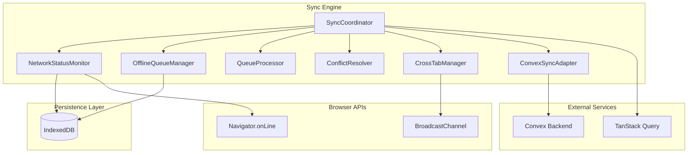
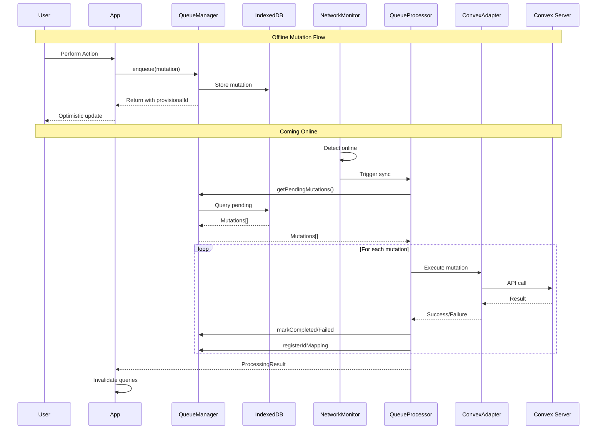
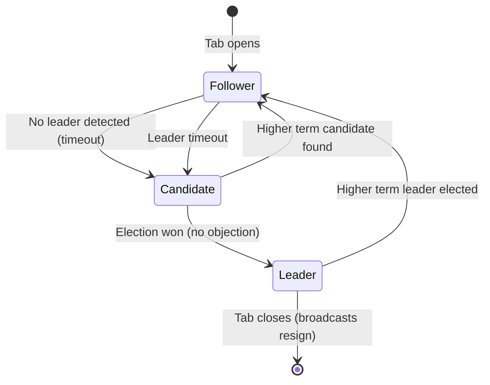

# @open-insights-web/foundation-sync-engine

A robust, enterprise-grade offline-first synchronization engine for web applications. This library provides automatic data synchronization between local IndexedDB storage and a Convex backend, with comprehensive conflict resolution, cross-tab coordination, and TanStack Query integration.

## Table of Contents

- [Overview](#overview)
- [Key Features](#key-features)
- [Installation](#installation)
- [Quick Start](#quick-start)
- [Architecture](#architecture)
  - [Component Hierarchy](#component-hierarchy)
  - [Data Flow](#data-flow)
  - [Module Structure](#module-structure)
- [Core Components](#core-components)
  - [SyncCoordinator](#synccoordinator)
  - [NetworkStatusMonitor](#networkstatusmonitor)
  - [OfflineQueueManager](#offlinequeuemanager)
  - [QueueProcessor](#queueprocessor)
  - [ConflictResolver](#conflictresolver)
  - [CrossTabManager](#crosstabmanager)
  - [ConvexSyncAdapter](#convexsyncadapter)
- [Configuration Reference](#configuration-reference)
- [API Reference](#api-reference)
  - [Interfaces](#interfaces)
  - [Types](#types)
  - [Factory Functions](#factory-functions)
  - [Singleton Accessors](#singleton-accessors)
- [Conflict Resolution](#conflict-resolution)
  - [Strategies](#strategies)
  - [Merge Configuration](#merge-configuration)
  - [Custom Resolution](#custom-resolution)
- [Cross-Tab Coordination](#cross-tab-coordination)
  - [Leader Election](#leader-election)
  - [Message Types](#message-types)
  - [Communication Protocol](#communication-protocol)
- [TanStack Query Integration](#tanstack-query-integration)
  - [Offline Query Functions](#offline-query-functions)
  - [Offline Mutation Functions](#offline-mutation-functions)
- [Error Handling](#error-handling)
- [Testing](#testing)
- [Performance Considerations](#performance-considerations)
- [Browser Compatibility](#browser-compatibility)
- [Dependencies](#dependencies)
- [Changelog](#changelog)

---

## Overview

The Foundation Sync Engine provides a complete solution for building offline-first web applications. It handles the complexity of:

- **Offline Data Persistence**: Mutations are queued in IndexedDB when offline
- **Automatic Synchronization**: Seamlessly syncs when connectivity returns
- **Conflict Resolution**: Multiple strategies for handling data conflicts
- **Cross-Tab Coordination**: Ensures only one tab performs sync operations
- **ID Mapping**: Maps provisional (client-generated) IDs to server IDs

### Design Principles

1. **Offline-First**: Operations work seamlessly offline and sync when online
2. **Type-Safe**: Full TypeScript support with strict typing
3. **Memory-Safe**: Proper disposal patterns prevent memory leaks
4. **Composable**: Components can be used independently or together
5. **Testable**: Dependency injection enables easy mocking

---

## Key Features

| Feature | Description |
|---------|-------------|
| **Offline Persistence** | Mutations survive page refreshes and browser restarts |
| **Automatic Sync** | Triggers on network status changes |
| **Conflict Resolution** | 5 built-in strategies with per-table configuration |
| **Cross-Tab Sync** | Raft-inspired leader election for coordination |
| **Provisional IDs** | Client-generated IDs mapped to server IDs |
| **Retry Logic** | Exponential backoff with configurable retry policies |
| **TanStack Integration** | Query invalidation and cache management |
| **Convex Support** | Purpose-built adapter for Convex backend |

---

## Installation

```bash
npm install @open-insights-web/foundation-sync-engine
```

### Peer Dependencies

```bash
npm install @tanstack/react-query convex react
```

### Foundation Dependencies

The sync engine requires these foundation libraries:

```bash
npm install @open-insights-web/foundation-database
npm install @open-insights-web/foundation-data-model
npm install @open-insights-web/foundation-utils
```

---

## Quick Start

### Basic Setup

```typescript
import { createSyncCoordinator } from '@open-insights-web/foundation-sync-engine';
import { QueryClient } from '@tanstack/react-query';
import { ConvexReactClient } from 'convex/react';

// Create clients
const queryClient = new QueryClient();
const convexClient = new ConvexReactClient(process.env.CONVEX_URL!);

// Create the sync coordinator
const coordinator = createSyncCoordinator({
  queryClient,
  convexClient,
  conflictStrategy: 'last-write-wins',
  enableCrossTab: true,
  debug: process.env.NODE_ENV === 'development',
});

// Start synchronization
await coordinator.start();

// Subscribe to sync events
const unsubscribe = coordinator.subscribe((event) => {
  console.log('Sync event:', event.type, event.timestamp);
});

// Cleanup when done
await coordinator.disposeAsync();
```

### With Mutation Map

```typescript
import { api } from '../convex/_generated/api';

const coordinator = createSyncCoordinator({
  queryClient,
  convexClient,
  mutationMap: {
    'tasks:create': {
      mutation: api.tasks.create,
      getArgs: (entry) => ({
        title: entry.payload.title,
        completed: entry.payload.completed ?? false,
      }),
      extractServerId: (result) => result._id,
    },
    'tasks:update': {
      mutation: api.tasks.update,
      getArgs: (entry) => ({
        id: entry.entityId,
        ...entry.payload,
      }),
    },
    'tasks:delete': {
      mutation: api.tasks.remove,
      getArgs: (entry) => ({ id: entry.entityId }),
    },
  },
});
```

---

## Architecture

### Component Hierarchy



### Data Flow



### Module Structure

```
libs/foundation/sync-engine/src/
├── index.ts              # Public API exports
├── internal.ts           # Internal exports (for foundation use)
├── coordinator/          # Main orchestrator
│   └── index.ts
├── core/                 # Core interfaces and utilities
│   ├── index.ts
│   ├── interfaces.ts     # DI interfaces
│   ├── container.ts      # DI container
│   ├── defaults.ts       # Default configuration
│   └── error-handler-mixin.ts
├── network/              # Network status monitoring
│   └── index.ts
├── queue/                # Mutation queue management
│   ├── index.ts
│   ├── manager.ts        # Queue storage and ID mapping
│   └── processor.ts      # Queue execution
├── conflicts/            # Conflict resolution
│   ├── index.ts
│   ├── resolver.ts
│   └── strategies.ts
├── cross-tab/            # Cross-tab coordination
│   ├── index.ts
│   └── manager.ts
├── convex/               # Convex backend adapter
│   ├── index.ts
│   ├── adapter.ts
│   └── functions.ts
└── tanstack/             # TanStack Query integration
    ├── index.ts
    ├── query-fn.ts
    └── mutation-fn.ts
```

---

## Core Components

### SyncCoordinator

The main orchestrator that manages the sync lifecycle and coordinates all other components.

```typescript
import { 
  createSyncCoordinator,
  getSyncCoordinator,
  resetSyncCoordinator,
} from '@open-insights-web/foundation-sync-engine';
import type { SyncState, ProcessingResult } from '@open-insights-web/foundation-data-model';

// Create a new instance
const coordinator = createSyncCoordinator({
  queryClient,
  convexClient,
  conflictStrategy: 'last-write-wins',
  enableCrossTab: true,
});

// Or get the singleton instance
const singleton = getSyncCoordinator(config);

// Lifecycle management
await coordinator.start();      // Start monitoring and sync
coordinator.stop();             // Stop without disposing
await coordinator.disposeAsync(); // Full cleanup

// Get current state
const state: SyncState = await coordinator.getState();
// {
//   isOnline: boolean,
//   isSyncing: boolean,
//   lastSyncAt: number | null,
//   pendingMutations: number,
//   failedMutations: number,
//   isLeader: boolean,
// }

// Manual sync trigger
const result: ProcessingResult | null = await coordinator.sync();

// Query invalidation
coordinator.invalidateQueries([['tasks'], ['users', userId]]);

// Event subscription
const unsubscribe = coordinator.subscribe((event) => {
  switch (event.type) {
    case 'online':
      console.log('Network came online');
      break;
    case 'offline':
      console.log('Network went offline');
      break;
    case 'sync-start':
      console.log('Sync started');
      break;
    case 'sync-complete':
      console.log('Sync completed:', event.data?.queueResult);
      break;
    case 'sync-error':
      console.error('Sync error:', event.data?.error);
      break;
    case 'conflict-detected':
      console.warn('Conflicts:', event.data?.conflictCount);
      break;
    case 'leader-changed':
      console.log('Leader status:', event.data?.isLeader);
      break;
  }
});

// Access child components
const networkMonitor = coordinator.getNetworkMonitor();
const queueManager = coordinator.getQueueManager();
const conflictResolver = coordinator.getConflictResolver();
const convexAdapter = coordinator.getConvexAdapter();
```

### NetworkStatusMonitor

Monitors network connectivity with health checks and browser events.

```typescript
import { 
  createNetworkMonitor,
  getNetworkMonitor,
  NETWORK_STATUS_EVENT,
} from '@open-insights-web/foundation-sync-engine';
import type { NetworkStatus } from '@open-insights-web/foundation-data-model';

const monitor = createNetworkMonitor({
  healthCheckUrl: '/api/health',
  healthCheckInterval: 30000,  // 30 seconds
  healthCheckTimeout: 5000,    // 5 seconds
  debug: false,
});

// Lifecycle
await monitor.start();
monitor.stop();
await monitor.disposeAsync();

// Status access
const status: NetworkStatus = monitor.status;
const isOnline: boolean = monitor.isOnline;

// Manual connectivity check
const connected = await monitor.checkConnectivity();

// Subscribe to changes
const unsubscribe = monitor.subscribe((status) => {
  console.log('Network status:', status.isOnline);
  console.log('Connection type:', status.connectionType);
});

// NETWORK_STATUS_EVENT constants
console.log(NETWORK_STATUS_EVENT.ONLINE);           // 'online'
console.log(NETWORK_STATUS_EVENT.OFFLINE);          // 'offline'
console.log(NETWORK_STATUS_EVENT.CONNECTIVITY_CHECK); // 'connectivity-check'
```

### OfflineQueueManager

Manages the mutation queue with IndexedDB persistence and ID mapping.

```typescript
import { 
  createQueueManager,
  getQueueManager,
  hasQueueManager,
} from '@open-insights-web/foundation-sync-engine';
import type { QueueStats, IdMapping } from '@open-insights-web/foundation-data-model';

const manager = createQueueManager({
  maxRetries: 3,
  maxIdMappings: 1000,
  idMappingTtlMs: 24 * 60 * 60 * 1000, // 24 hours
  debug: false,
});

// Enqueue mutations
const entry = await manager.enqueue({
  type: 'create',      // 'create' | 'update' | 'delete'
  tableName: 'tasks',
  entityId: undefined, // Auto-generates provisional ID for creates
  payload: { title: 'New Task', completed: false },
  optimisticData: { id: 'prov_123', title: 'New Task' },
  invalidateKeys: [JSON.stringify(['tasks'])],
  dependsOn: [],       // Mutation IDs this depends on
});

// Query mutations
const pending = await manager.getPendingMutations();
const byStatus = await manager.getByStatus('in_progress');
const mutation = await manager.get(mutationId);
const byKey = await manager.findByIdempotencyKey('unique-key');

// Status updates
await manager.markInProgress(mutationId);
await manager.markCompleted(mutationId, serverId);
await manager.markFailed(mutationId, 'Error message');
await manager.markAllOfflineQueued();  // When going offline
await manager.markAllPending();        // When coming online

// Statistics
const stats: QueueStats = await manager.getStats();
// { pending, inProgress, failed, offlineQueued, total }

const hasPending = await manager.hasPending();

// ID Mapping
await manager.registerIdMapping({
  provisionalId: 'prov_123',
  serverId: 'server_abc',
  tableName: 'tasks',
  mappedAt: new Date().toISOString(),
});

const serverId = manager.getServerId('prov_123');
const resolvedId = manager.resolveId(someId);
const mappings: IdMapping[] = manager.getIdMappings();
manager.clearIdMappings();

// Resolve IDs in payload
const resolved = manager.resolvePayloadIds({
  parentId: 'prov_123',
  tags: ['prov_456', 'regular_789'],
});

// Cleanup
await manager.deleteCompleted();
await manager.clear();
manager.dispose();
```

### QueueProcessor

Processes the mutation queue with retry logic and conflict detection.

```typescript
import { createQueueProcessor } from '@open-insights-web/foundation-sync-engine';
import type { ProcessingResult } from '@open-insights-web/foundation-data-model';

const processor = createQueueProcessor({
  queueManager,
  conflictResolver,
  executor: async (mutation) => {
    const result = await convexClient.mutation(
      api.tasks[mutation.type],
      mutation.payload
    );
    return {
      success: true,
      data: result,
      serverId: result._id,
      serverTimestamp: Date.now(),
    };
  },

  batchSize: 10,
  baseDelayBetweenMutations: 100,
  autoCleanup: true,

  retryConfig: {
    maxAttempts: 3,
    initialDelayMs: 1000,
    maxDelayMs: 30000,
    backoffMultiplier: 2,
    jitter: true,
    isRetryable: (error) => isNetworkError(error),
    onRetry: (attempt, error, delayMs) => {
      console.log(`Retry ${attempt} after ${delayMs}ms`);
    },
  },

  onSuccess: (mutation, result) => {
    console.log('Mutation succeeded:', mutation.id);
  },
  onFailure: (mutation, error) => {
    console.error('Mutation failed:', mutation.id, error);
  },
  onConflict: (mutation, context) => {
    console.warn('Conflict detected:', mutation.id);
  },
  onError: (error, mutation) => {
    // Centralized error handling
  },
});

// Process queue
const result: ProcessingResult = await processor.process();
// { processed, succeeded, failed, skipped, idMappings }

// Check status
const isProcessing = processor.processing;

// Stop and cleanup
processor.stop();
processor.dispose();
```

### ConflictResolver

Resolves conflicts between server and client data using configurable strategies.

```typescript
import { 
  createConflictResolver,
  DEFAULT_MERGE_CONFIG,
} from '@open-insights-web/foundation-sync-engine';
import { 
  ConflictStrategy,
  type ConflictContext,
  type ConflictResult,
  type MergeConfig,
} from '@open-insights-web/foundation-data-model';

const resolver = createConflictResolver({
  defaultStrategy: ConflictStrategy.LAST_WRITE_WINS,

  tableStrategies: {
    'user_settings': ConflictStrategy.CLIENT_WINS,
    'critical_data': ConflictStrategy.SERVER_WINS,
    'documents': ConflictStrategy.MERGE,
  },

  mergeConfig: {
    serverWinsFields: ['id', 'createdAt', 'tenantId'],
    clientWinsFields: ['localNotes'],
    concatFields: ['tags'],
    unionFields: ['members'],
    customMerge: {
      metadata: (server, client, base) => ({
        ...server,
        ...client,
      }),
    },
  },

  onConflictReview: (context, result) => {
    console.warn('Manual review needed:', result.conflictedFields);
  },
});

// Get strategy for table
const strategy = resolver.getStrategy('tasks');

// Check for conflict
const hasConflict = resolver.hasConflict(
  serverData,
  clientData,
  serverTimestamp,
  clientTimestamp
);

// Resolve conflict
const context: ConflictContext<Task> = {
  serverData: { id: '1', title: 'Server Title' },
  serverTimestamp: 1000,
  clientData: { id: '1', title: 'Client Title' },
  clientTimestamp: 900,
  tableName: 'tasks',
  entityId: '1',
  baseData: { id: '1', title: 'Original' },
};

const result: ConflictResult<Task> = resolver.resolve(context);
// { resolvedData, winner, requiresReview, mergedFields, conflictedFields }

// Runtime configuration
resolver.setTableStrategy('new_table', ConflictStrategy.MERGE);
resolver.setTableMergeConfig('new_table', customMergeConfig);

resolver.dispose();
```

### CrossTabManager

Coordinates synchronization across browser tabs using BroadcastChannel and Raft-inspired leader election.

```typescript
import { 
  createCrossTabManager,
  CrossTabManager,
} from '@open-insights-web/foundation-sync-engine';
import { 
  CrossTabMessageType,
  type CrossTabMessage,
} from '@open-insights-web/foundation-data-model';

// Check support before creating
if (CrossTabManager.isSupported()) {
  const manager = createCrossTabManager({
    channelName: 'open-insights-sync',
    leaderHeartbeatInterval: 2000,
    leaderTimeout: 5000,
    debug: false,
  });

  manager.start();

  // Tab identity
  const tabId: string = manager.id;
  const isLeader: boolean = manager.isLeader;

  // Subscribe to messages
  const unsubscribe = manager.subscribe(
    CrossTabMessageType.MUTATION_COMPLETED,
    (message) => {
      console.log('Mutation completed in another tab:', message.payload);
    }
  );

  // Broadcast messages
  manager.broadcast(CrossTabMessageType.CACHE_UPDATED, {
    tableName: 'tasks',
    queryKeys: [['tasks']],
  });

  // Convenience methods
  manager.invalidateQueries([['tasks']]);
  manager.notifyMutationCompleted('tasks', 'entity-123', 'mutation-456', data);
  manager.notifyOnline();
  manager.notifyOffline();
  manager.notifySyncStarted();
  manager.notifySyncCompleted();

  // Monitoring
  const subscriptionCount = manager.getSubscriptionCount();

  // Cleanup
  manager.stop();
  manager.dispose();
}
```

### ConvexSyncAdapter

Adapter for executing queries and mutations against a Convex backend.

```typescript
import { createConvexAdapter } from '@open-insights-web/foundation-sync-engine';
import { api } from '../convex/_generated/api';

const adapter = createConvexAdapter({
  client: convexClient,
  debug: false,
});

// Query execution
const tasks = await adapter.query(api.tasks.list, { limit: 10 });

// Mutation execution
const newTask = await adapter.mutate(api.tasks.create, {
  title: 'New Task',
});

// Create mutation executor for queue processor
const executor = adapter.createMutationExecutor({
  'tasks:create': {
    mutation: api.tasks.create,
    getArgs: (entry) => ({ title: entry.payload.title }),
    extractServerId: (result) => result._id,
    extractServerData: (result) => result,
  },
  'tasks:update': {
    mutation: api.tasks.update,
    getArgs: (entry) => ({ id: entry.entityId, ...entry.payload }),
  },
  'tasks:delete': {
    mutation: api.tasks.remove,
    getArgs: (entry) => ({ id: entry.entityId }),
  },
});

// Polling-based subscription (for non-React contexts)
const unsubscribe = adapter.subscribe(
  api.tasks.list,
  { limit: 100 },
  {
    onUpdate: (data) => console.log('Tasks updated:', data),
    onError: (error) => console.error('Error:', error),
  },
  5000 // Poll interval
);

// Trigger immediate refresh
adapter.refreshSubscriptions();

// Monitoring
const activeCount = adapter.getActiveSubscriptionCount();

// Cleanup
adapter.dispose();
```

---

## Configuration Reference

### SyncCoordinatorConfig

| Option | Type | Default | Description |
|--------|------|---------|-------------|
| `queryClient` | `QueryClient` | **Required** | TanStack Query client instance |
| `convexClient` | `ConvexReactClient` | **Required** | Convex React client instance |
| `database` | `InsightsDatabase` | Auto-created | Database instance for persistence |
| `conflictStrategy` | `ConflictStrategy` | `'last-write-wins'` | Default conflict resolution strategy |
| `mutationMap` | `Record<string, ConvexMutationOptions>` | `undefined` | Mutation configurations |
| `autoStart` | `boolean` | `true` | Auto-start on creation |
| `enableCrossTab` | `boolean` | `true` | Enable cross-tab sync |
| `healthCheckUrl` | `string` | `'/api/health'` | URL for connectivity checks |
| `healthCheckInterval` | `number` | `30000` | Health check interval (ms) |
| `debug` | `boolean` | `false` | Enable debug logging |
| `onError` | `(error, context?) => void` | `undefined` | Error callback |

### NetworkMonitorConfig

| Option | Type | Default | Description |
|--------|------|---------|-------------|
| `database` | `InsightsDatabase` | Auto-created | Database instance |
| `healthCheckUrl` | `string` | `'/api/health'` | Health check URL |
| `healthCheckInterval` | `number` | `30000` | Check interval (ms) |
| `healthCheckTimeout` | `number` | `5000` | Request timeout (ms) |
| `debug` | `boolean` | `false` | Enable debug logging |

### QueueManagerConfig

| Option | Type | Default | Description |
|--------|------|---------|-------------|
| `database` | `InsightsDatabase` | Auto-created | Database instance |
| `maxRetries` | `number` | `3` | Max retry attempts |
| `maxIdMappings` | `number` | `1000` | Max ID mappings (LRU eviction) |
| `idMappingTtlMs` | `number` | `86400000` | ID mapping TTL (24 hours) |
| `debug` | `boolean` | `false` | Enable debug logging |

### QueueProcessorConfig

| Option | Type | Default | Description |
|--------|------|---------|-------------|
| `executor` | `MutationExecutor` | **Required** | Mutation executor function |
| `queueManager` | `OfflineQueueManager` | **Required** | Queue manager instance |
| `conflictResolver` | `ConflictResolver` | **Required** | Conflict resolver instance |
| `batchSize` | `number` | `10` | Mutations per batch |
| `baseDelayBetweenMutations` | `number` | `100` | Delay between mutations (ms) |
| `retryConfig` | `Partial<RetryConfig>` | See defaults | Retry configuration |
| `autoCleanup` | `boolean` | `true` | Auto-delete completed mutations |
| `debug` | `boolean` | `false` | Enable debug logging |

### RetryConfig

| Option | Type | Default | Description |
|--------|------|---------|-------------|
| `maxAttempts` | `number` | `3` | Max retry attempts |
| `initialDelayMs` | `number` | `1000` | Initial backoff delay |
| `maxDelayMs` | `number` | `30000` | Max backoff delay |
| `backoffMultiplier` | `number` | `2` | Exponential multiplier |
| `jitter` | `boolean` | `true` | Add random jitter |
| `isRetryable` | `(error) => boolean` | Network errors | Determine if retryable |
| `onRetry` | `(attempt, error, delay) => void` | `undefined` | Retry callback |

### CrossTabManagerConfig

| Option | Type | Default | Description |
|--------|------|---------|-------------|
| `channelName` | `string` | `'open-insights-sync'` | BroadcastChannel name |
| `leaderHeartbeatInterval` | `number` | `2000` | Heartbeat interval (ms) |
| `leaderTimeout` | `number` | `5000` | Leader timeout (ms) |
| `debug` | `boolean` | `false` | Enable debug logging |

---

## API Reference

### Interfaces

```typescript
// Sync Coordinator
interface ISyncCoordinator extends IAsyncDisposable {
  getState(): Promise<SyncState>;
  start(): Promise<void>;
  stop(): void;
  sync(): Promise<ProcessingResult | null>;
  subscribe(listener: SyncEventListener): () => void;
  invalidateQueries(queryKeys: QueryKeyBase[]): void;
  getNetworkMonitor(): INetworkMonitor;
  getQueueManager(): IQueueManager;
  getConflictResolver(): IConflictResolver;
}

// Network Monitor
interface INetworkMonitor extends IAsyncDisposable {
  readonly status: NetworkStatus;
  readonly isOnline: boolean;
  start(): Promise<void>;
  stop(): void;
  subscribe(listener: NetworkStatusListener): () => void;
  checkConnectivity(): Promise<boolean>;
}

// Queue Manager (combines operations and ID mapping)
interface IQueueManager extends IQueueOperations, IIdMappingStore {}

interface IQueueOperations extends IDisposable {
  enqueue(options: CreateMutationOptions): Promise<MutationQueueEntry>;
  get(id: string): Promise<MutationQueueEntry | undefined>;
  getPendingMutations(): Promise<MutationQueueEntry[]>;
  getByStatus(status: MutationStatus): Promise<MutationQueueEntry[]>;
  updateStatus(id: string, status: MutationStatus, updates?: Partial<MutationQueueEntry>): Promise<void>;
  markInProgress(id: string): Promise<void>;
  markCompleted(id: string, serverId?: string): Promise<void>;
  markFailed(id: string, error: string): Promise<void>;
  markAllOfflineQueued(): Promise<number>;
  markAllPending(): Promise<number>;
  delete(id: string): Promise<void>;
  deleteCompleted(): Promise<number>;
  clear(): Promise<void>;
  getStats(): Promise<QueueStats>;
  hasPending(): Promise<boolean>;
  findByIdempotencyKey(key: string): Promise<MutationQueueEntry | undefined>;
}

interface IIdMappingStore {
  registerIdMapping(mapping: IdMapping): void | Promise<void>;
  getServerId(provisionalId: string): string | undefined;
  resolveId(id: string): string;
  getIdMappings(): IdMapping[];
  clearIdMappings(): void;
  resolvePayloadIds<T extends Record<string, unknown>>(payload: T): T;
}

// Conflict Resolver
interface IConflictResolver extends IDisposable {
  getStrategy(tableName: string): ConflictStrategy;
  resolve<T>(context: ConflictContext<T>): ConflictResult<T>;
  hasConflict<T>(serverData: T, clientData: T, serverTimestamp: number, clientTimestamp: number): boolean;
  setTableStrategy(tableName: string, strategy: ConflictStrategy): void;
}

// Cross-Tab Manager
interface ICrossTabManager extends IDisposable {
  readonly id: string;
  readonly isLeader: boolean;
  start(): void;
  stop(): void;
  subscribe(type: CrossTabMessageType, handler: CrossTabMessageHandler): () => void;
  broadcast(type: CrossTabMessageType, payload?: CrossTabMessagePayload): void;
  invalidateQueries(queryKeys: QueryKeyBase[]): void;
  notifyMutationCompleted(tableName: string, entityId: string, mutationId: string, data?: unknown): void;
  notifyOnline(): void;
  notifyOffline(): void;
  notifySyncStarted(): void;
  notifySyncCompleted(): void;
}
```

### Types

Import sync-related types from `@open-insights-web/foundation-data-model`:

```typescript
import {
  // Conflict Resolution
  ConflictStrategy,
  type ConflictContext,
  type ConflictResult,
  type MergeConfig,
  
  // Queue
  type QueueStats,
  type ProcessingResult,
  
  // Sync State
  type SyncState,
  SyncEventType,
  type SyncEvent,
  type SyncEventListener,
  
  // Network
  type NetworkStatus,
  type NetworkStatusListener,
  
  // Cross-Tab
  CrossTabMessageType,
  type CrossTabMessage,
  type CrossTabMessagePayload,
  type CrossTabMessageHandler,
  
  // Query/Mutation
  type OfflineQueryContext,
  type OfflineMutationResult,
  
  // ID Mapping
  type IdMapping,
} from '@open-insights-web/foundation-data-model';
```

### Factory Functions

```typescript
// Creates new instances (non-singleton)
const createSyncCoordinator: (config: SyncCoordinatorConfig) => SyncCoordinator;
const createAndStartSyncCoordinator: (config: SyncCoordinatorConfig) => Promise<SyncCoordinator>;
const createNetworkMonitor: (config?: NetworkMonitorConfig) => NetworkStatusMonitor;
const createQueueManager: (config?: QueueManagerConfig) => OfflineQueueManager;
const createQueueProcessor: (config: QueueProcessorConfig) => QueueProcessor;
const createConflictResolver: (config?: Partial<ConflictResolverConfig>) => ConflictResolver;
const createCrossTabManager: (config?: CrossTabManagerConfig) => CrossTabManager;
const createConvexAdapter: (config: ConvexAdapterConfig) => ConvexSyncAdapter;
```

### Singleton Accessors (Legacy/Test Convenience)

```typescript
// Legacy/testing helpers for shared instances
const getSyncCoordinator: (config: SyncCoordinatorConfig) => SyncCoordinator;
const getNetworkMonitor: (config?: NetworkMonitorConfig) => NetworkStatusMonitor;
const getQueueManager: (config?: QueueManagerConfig) => OfflineQueueManager;
const getConflictResolver: (config?: Partial<ConflictResolverConfig>) => ConflictResolver;
const getCrossTabManager: (config?: CrossTabManagerConfig) => CrossTabManager;

// Reset helpers (primarily for tests)
const resetSyncCoordinator: () => void;
const resetNetworkMonitor: () => void;
const resetQueueManager: () => void;
const resetConflictResolver: () => void;
const resetCrossTabManager: () => void;

// Check if singleton exists
const hasQueueManager: () => boolean;
```

Use instance-scoped factories for production wiring (`create*` APIs) and reserve singleton helpers for test harnesses or legacy integration.

---

## Conflict Resolution

### Strategies

| Strategy | Constant | Description | Use Case |
|----------|----------|-------------|----------|
| Server Wins | `ConflictStrategy.SERVER_WINS` | Server data always takes precedence | Audit logs, system data |
| Client Wins | `ConflictStrategy.CLIENT_WINS` | Client data always takes precedence | User preferences |
| Last Write Wins | `ConflictStrategy.LAST_WRITE_WINS` | Most recent timestamp wins | Simple versioning |
| Merge | `ConflictStrategy.MERGE` | Field-level intelligent merge | Collaborative editing |
| Manual | `ConflictStrategy.MANUAL` | Flag for UI resolution | Critical conflicts |

### Merge Configuration

```typescript
const mergeConfig: MergeConfig = {
  // Fields where server always wins
  serverWinsFields: ['id', 'createdAt', 'tenantId', 'version'],
  
  // Fields where client always wins
  clientWinsFields: ['localNotes', 'userPreferences'],
  
  // Array fields to concatenate
  concatFields: ['auditLog', 'history'],
  
  // Array fields to merge (union with deduplication)
  unionFields: ['tags', 'collaborators'],
  
  // Custom merge functions
  customMerge: {
    metadata: (serverValue, clientValue, baseValue) => ({
      ...serverValue,
      localChanges: clientValue.localChanges,
    }),
  },
};
```

### Auto-Merge Logic

When a field isn't covered by explicit rules:

1. **Values are equal**: Use either (no conflict)
2. **Client unchanged from base**: Use server value
3. **Server unchanged from base**: Use client value
4. **Both changed**: Mark as conflict, use server, flag for review

---

## Cross-Tab Coordination

### Leader Election

The library uses a Raft-inspired algorithm:



**Key Features:**
- **Term Numbers**: Each election has an incrementing term; higher terms win
- **Staggered Delays**: Tabs use deterministic delays based on tab ID hash
- **Heartbeats**: Leader sends periodic heartbeats (adaptive: 2-8 seconds)
- **Timeout Detection**: New election starts if heartbeats stop for 5 seconds

### Message Types

```typescript
// Import from data-model
import { CrossTabMessageType } from '@open-insights-web/foundation-data-model';

// Available message types
CrossTabMessageType.INVALIDATE         // Query invalidation
CrossTabMessageType.MUTATION_COMPLETED // Mutation finished
CrossTabMessageType.ONLINE             // Network came online
CrossTabMessageType.OFFLINE            // Network went offline
CrossTabMessageType.SYNC_STARTED       // Sync started
CrossTabMessageType.SYNC_COMPLETED     // Sync completed
CrossTabMessageType.CACHE_UPDATED      // Cache updated
CrossTabMessageType.LEADER_ELECTED     // New leader
CrossTabMessageType.LEADER_HEARTBEAT   // Leader heartbeat
CrossTabMessageType.LEADER_RESIGN      // Leader stepping down
CrossTabMessageType.LEADER_CANDIDATE   // Tab requesting leadership
```

---

## TanStack Query Integration

### Offline Query Functions

```typescript
import { 
  createOfflineQueryFn,
  createOfflineQueryFnWithContext,
} from '@open-insights-web/foundation-sync-engine';
import type { OfflineQueryContext } from '@open-insights-web/foundation-data-model';

// Basic offline-aware query
const queryFn = createOfflineQueryFn({
  fetchFn: async (queryKey) => {
    const [table, id] = queryKey;
    return await convexClient.query(api.tasks.get, { id });
  },
  cacheTTL: 5 * 60 * 1000, // 5 minutes
  staleWhileRevalidate: true,
});

// Use with TanStack Query
const { data } = useQuery({
  queryKey: ['tasks', taskId],
  queryFn,
});

// Query with context (includes offline metadata)
const queryFnWithContext = createOfflineQueryFnWithContext({
  fetchFn: async (queryKey) => {
    return await convexClient.query(api.tasks.list);
  },
});

const { data } = useQuery({
  queryKey: ['tasks'],
  queryFn: queryFnWithContext,
});

// Access context
// data.data - the actual data
// data.context.isOffline - fetched while offline
// data.context.isStale - data is stale
// data.context.source - 'cache' | 'network' | 'offline_db'
// data.context.cachedAt - when cached
```

### Offline Mutation Functions

```typescript
import { 
  createOfflineMutationFn,
  createOnlineMutationFn,
} from '@open-insights-web/foundation-sync-engine';
import type { OfflineMutationResult } from '@open-insights-web/foundation-data-model';

// Offline-aware mutation (queues when offline)
const mutationFn = createOfflineMutationFn({
  mutateFn: async (variables) => {
    return await convexClient.mutation(api.tasks.create, variables);
  },
  type: 'create',
  tableName: 'tasks',
  getEntityId: (variables) => variables.id,
  getOptimisticData: (variables) => ({
    ...variables,
    id: generateProvisionalId(),
    createdAt: Date.now(),
  }),
  invalidateKeys: [['tasks']],
});

// Use with TanStack Query
const mutation = useMutation({
  mutationFn,
  onSuccess: (result) => {
    if (result.queued) {
      console.log('Mutation queued for later');
    } else {
      console.log('Mutation completed:', result.data);
    }
  },
});

// Online-only mutation (fails when offline)
const onlineMutationFn = createOnlineMutationFn(
  async (variables) => {
    return await convexClient.mutation(api.auth.login, variables);
  }
);
```

---

## Error Handling

### Centralized Error Callbacks

```typescript
const coordinator = createSyncCoordinator({
  queryClient,
  convexClient,
  onError: (error, context) => {
    // Log to monitoring service
    errorTracker.capture(error, { context });
    
    // Show user notification
    if (context === 'Sync') {
      toast.error('Sync failed. Changes will retry automatically.');
    }
  },
});
```

### Error Categories

| Category | Retried | Example |
|----------|---------|---------|
| Network Errors | Yes | Connection timeout |
| Server Errors (5xx) | Yes | Internal server error |
| Validation Errors | No | Invalid input |
| Client Errors (4xx) | No | Unauthorized |

### Handling Failed Mutations

```typescript
// Get failed mutations
const failed = await queueManager.getByStatus('failed');

// Retry a specific mutation
await queueManager.updateStatus(mutationId, 'pending');

// Or clear failed mutations
for (const mutation of failed) {
  await queueManager.delete(mutation.id);
}
```

---

## Testing

### Running Tests

```bash
nx test foundation-sync-engine
```

### Mocking Components

```typescript
import { vi } from 'vitest';

// Mock network monitor
const mockNetworkMonitor = {
  status: { isOnline: true, lastOnlineAt: Date.now(), lastOfflineAt: null },
  isOnline: true,
  start: vi.fn(),
  stop: vi.fn(),
  subscribe: vi.fn(() => () => {}),
  checkConnectivity: vi.fn(() => Promise.resolve(true)),
  disposeAsync: vi.fn(() => Promise.resolve()),
};

// Mock queue manager
const mockQueueManager = {
  enqueue: vi.fn(),
  getPendingMutations: vi.fn(() => Promise.resolve([])),
  getStats: vi.fn(() => Promise.resolve({
    pending: 0, inProgress: 0, failed: 0, offlineQueued: 0, total: 0
  })),
  markInProgress: vi.fn(),
  markCompleted: vi.fn(),
  markFailed: vi.fn(),
  registerIdMapping: vi.fn(),
  getServerId: vi.fn(),
  resolveId: vi.fn((id) => id),
  dispose: vi.fn(),
};
```

### Testing Offline Scenarios

```typescript
describe('Offline Sync', () => {
  it('should queue mutations when offline', async () => {
    mockNetworkMonitor.isOnline = false;
    
    const result = await mutationFn({ title: 'Test' });
    
    expect(result.queued).toBe(true);
    expect(result.isOffline).toBe(true);
    expect(mockQueueManager.enqueue).toHaveBeenCalled();
  });

  it('should process queue when coming online', async () => {
    mockNetworkMonitor.isOnline = false;
    await mutationFn({ title: 'Test' });
    
    mockNetworkMonitor.isOnline = true;
    const listener = mockNetworkMonitor.subscribe.mock.calls[0][0];
    listener({ isOnline: true });
    
    await vi.waitFor(() => {
      expect(mockProcessor.process).toHaveBeenCalled();
    });
  });
});
```

---

## Performance Considerations

### Memory Management

- **ID Mapping Limits**: Configure `maxIdMappings` to prevent unbounded growth
- **TTL Cleanup**: Mappings older than `idMappingTtlMs` are automatically cleaned
- **Completed Mutation Cleanup**: Enable `autoCleanup` to remove processed mutations
- **Subscription Cleanup**: Always call unsubscribe functions

### Database Performance

- **Batch Size**: Tune based on mutation complexity (default: 10)
- **Index Usage**: Mutations indexed by status for efficient queries
- **Count Queries**: Statistics use efficient count queries

### Network Optimization

- **Debounced Sync**: Sync requests debounced (100ms)
- **Leader-Only Processing**: Only leader tab processes queue
- **Adaptive Heartbeats**: Leader heartbeat adapts (2-8s) based on activity

### Memory-Safe Patterns

```typescript
// Always dispose components
useEffect(() => {
  const coordinator = createSyncCoordinator(config);
  coordinator.start();
  
  return () => {
    coordinator.disposeAsync();
  };
}, []);

// Always unsubscribe
useEffect(() => {
  const unsubscribe = coordinator.subscribe(handler);
  return unsubscribe;
}, []);
```

---

## Browser Compatibility

| Feature | Minimum Support | Fallback |
|---------|-----------------|----------|
| IndexedDB | All modern browsers | Required |
| BroadcastChannel | Chrome 54+, Firefox 38+, Safari 15.4+ | Single-tab mode |
| AbortController | Chrome 66+, Firefox 57+, Safari 12.1+ | Limited timeout support |
| crypto.randomUUID | Chrome 92+, Firefox 95+, Safari 15.4+ | Required |

### Feature Detection

```typescript
if (CrossTabManager.isSupported()) {
  // Enable cross-tab sync
}

const coordinator = createSyncCoordinator({
  enableCrossTab: CrossTabManager.isSupported(),
});
```

---

## Dependencies

### Runtime Dependencies

| Package | Purpose |
|---------|---------|
| `@open-insights-web/foundation-database` | IndexedDB persistence layer |
| `@open-insights-web/foundation-data-model` | Shared types and schemas |
| `@open-insights-web/foundation-utils` | Common utilities |
| `@tanstack/react-query` | Query/mutation cache management |
| `convex/react` | Convex React client |
| `zod` | Schema validation for cross-tab messages |
| `react-fast-compare` | Deep equality checks |

### Peer Dependencies

| Package | Version |
|---------|---------|
| `react` | ^18.0.0 |

---

## Changelog

See [CHANGELOG.md](./CHANGELOG.md) for version history and migration guides.

---

## License

MIT
